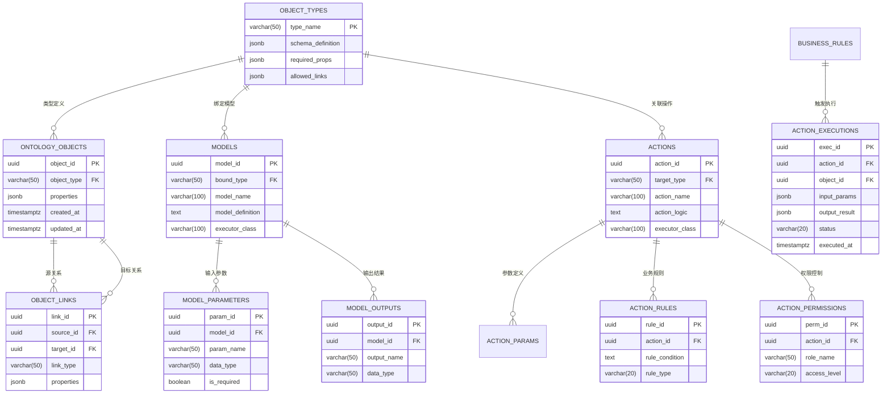

“1. 基石：在本体（Ontology）中定义“世界规则”

模拟的先决条件是拥有一个能够反映真实世界的数字孪生。这一步在Foundry的本体（Ontology）中完成。

定义对象与关系 (Objects & Links): 首先，开发者和业务分析师需要将组织的资产（如工厂、卡车、产品、员工）定义为“对象”，并将它们之间的业务关系（如“卡车”运输“产品”到“仓库”）定义为“链接”。这构建了模拟的静态结构。
定义模型与函数 (Models & Functions):接着，需要将业务逻辑、物理规则、机器学习模型或优化算法等封装成可在本体中调用的“模型”或“函数”。
示例：一个“供应链成本模型”可以接受“运输距离”、“燃油价格”、“货物重量”等输入，然后输出“总运输成本”。一个“生产线效率函数”可以根据“设备年龄”和“维护记录”计算出“预计故障率”。这些模型被发布并绑定到本体上，使其能理解特定对象的动态行为。
定义操作 (Actions):这是实现“可写回”的关键。Actions定义了用户可以对本体中的对象执行哪些变更操作，并内置了权限控制和业务规则。
示例：一个“调整供应商配额”的Action，允许用户修改“供应商”对象的“订单比例”属性，但规则可能限制总比例必须为100%。”结合这个本体的定义及前面详细设计内容，进一步详细设计Palantir Ontology的数据模型（表结构），具备生产实用的能力，给出ER关系模型，给出数据字典，给出mysql建表语句，给出详细完整案例及数据，出给推荐技术路线

# Palantir Ontology 生产级数据模型设计（增强版）

## 一、技术路线推荐

### 核心架构


### 技术栈选型
| 组件 | 技术选型 | 说明 |
|------|----------|------|
| **核心存储** | PostgreSQL 14+ | JSONB支持+图扩展+时序处理 |
| **图计算** | Apache AGE 2.0 | 原生Cypher支持 |
| **规则引擎** | Drools 8.0 + Kogito | 业务规则执行 |
| **AI集成** | LLaMA 3微调模型 | 自然语言本体建模 |
| **向量计算** | pgvector 0.5 | 相似性搜索 |
| **实时计算** | Apache Flink | 流式规则触发 |
| **前端框架** | React + Three.js | 3D数字孪生可视化 |
| **部署平台** | Kubernetes + Istio | 云原生部署 |

## 二、增强ER关系模型



## 三、数据字典（核心表）

### 1. 模型表 (models)
| 字段 | 类型 | 空 | 默认 | 描述 |
|------|------|----|------|------|
| model_id | UUID | N | gen_random_uuid() | 模型唯一ID |
| bound_type | VARCHAR(50) | N |  | 绑定对象类型 |
| model_name | VARCHAR(100) | N |  | 模型名称 |
| model_definition | TEXT | N |  | 模型逻辑(PMML/SQL/Python) |
| executor_class | VARCHAR(100) | N |  | 执行器类名/URL |
| version | INTEGER | N | 1 | 模型版本 |
| is_active | BOOLEAN | N | true | 是否激活 |

### 2. 操作表 (actions)
| 字段 | 类型 | 空 | 默认 | 描述 |
|------|------|----|------|------|
| action_id | UUID | N | gen_random_uuid() | 操作唯一ID |
| target_type | VARCHAR(50) | N |  | 目标对象类型 |
| action_name | VARCHAR(100) | N |  | 操作名称 |
| action_logic | TEXT | Y |  | 操作执行逻辑 |
| executor_class | VARCHAR(100) | N |  | 执行器类名/URL |
| validation_rules | JSONB | N | {} | 验证规则(JSON Schema) |
| rollback_strategy | TEXT | Y |  | 回滚策略 |

### 3. 操作规则表 (action_rules)
| 字段 | 类型 | 空 | 默认 | 描述 |
|------|------|----|------|------|
| rule_id | UUID | N | gen_random_uuid() | 规则ID |
| action_id | UUID | N |  | 关联操作ID |
| rule_condition | TEXT | N |  | 条件表达式 |
| rule_type | VARCHAR(20) | N |  | 规则类型(pre/post) |
| error_message | TEXT | N |  | 违反规则时的错误信息 |
| severity | VARCHAR(20) | N | 'ERROR' | 严重级别(ERROR/WARN) |

## 四、MySQL建表语句

```sql
-- 启用UUID扩展
CREATE EXTENSION IF NOT EXISTS "uuid-ossp";

-- 对象类型表
CREATE TABLE object_types (
    type_name VARCHAR(50) PRIMARY KEY,
    version INT NOT NULL DEFAULT 1,
    required_props JSON NOT NULL,
    allowed_links JSON NOT NULL,
    schema_definition JSON NOT NULL,
    created_at TIMESTAMP DEFAULT CURRENT_TIMESTAMP,
    updated_at TIMESTAMP DEFAULT CURRENT_TIMESTAMP ON UPDATE CURRENT_TIMESTAMP
);

-- 本体对象表
CREATE TABLE ontology_objects (
    object_id CHAR(36) PRIMARY KEY DEFAULT (UUID()),
    object_type VARCHAR(50) NOT NULL,
    properties JSON NOT NULL,
    created_at TIMESTAMP DEFAULT CURRENT_TIMESTAMP,
    updated_at TIMESTAMP DEFAULT CURRENT_TIMESTAMP ON UPDATE CURRENT_TIMESTAMP,
    FOREIGN KEY (object_type) REFERENCES object_types(type_name)
);

-- 对象关系表
CREATE TABLE object_links (
    link_id CHAR(36) PRIMARY KEY DEFAULT (UUID()),
    source_id CHAR(36) NOT NULL,
    target_id CHAR(36) NOT NULL,
    link_type VARCHAR(50) NOT NULL,
    properties JSON NOT NULL,
    created_at TIMESTAMP DEFAULT CURRENT_TIMESTAMP,
    FOREIGN KEY (source_id) REFERENCES ontology_objects(object_id),
    FOREIGN KEY (target_id) REFERENCES ontology_objects(object_id)
);

-- 模型表
CREATE TABLE models (
    model_id CHAR(36) PRIMARY KEY DEFAULT (UUID()),
    bound_type VARCHAR(50) NOT NULL,
    model_name VARCHAR(100) NOT NULL,
    model_definition TEXT NOT NULL,
    executor_class VARCHAR(100) NOT NULL,
    version INT NOT NULL DEFAULT 1,
    is_active BOOLEAN NOT NULL DEFAULT true,
    created_at TIMESTAMP DEFAULT CURRENT_TIMESTAMP,
    updated_at TIMESTAMP DEFAULT CURRENT_TIMESTAMP ON UPDATE CURRENT_TIMESTAMP,
    FOREIGN KEY (bound_type) REFERENCES object_types(type_name)
);

-- 模型参数表
CREATE TABLE model_parameters (
    param_id CHAR(36) PRIMARY KEY DEFAULT (UUID()),
    model_id CHAR(36) NOT NULL,
    param_name VARCHAR(50) NOT NULL,
    data_type VARCHAR(50) NOT NULL,
    is_required BOOLEAN NOT NULL DEFAULT true,
    FOREIGN KEY (model_id) REFERENCES models(model_id)
);

-- 操作表
CREATE TABLE actions (
    action_id CHAR(36) PRIMARY KEY DEFAULT (UUID()),
    target_type VARCHAR(50) NOT NULL,
    action_name VARCHAR(100) NOT NULL,
    action_logic TEXT,
    executor_class VARCHAR(100) NOT NULL,
    validation_rules JSON NOT NULL,
    rollback_strategy TEXT,
    created_at TIMESTAMP DEFAULT CURRENT_TIMESTAMP,
    updated_at TIMESTAMP DEFAULT CURRENT_TIMESTAMP ON UPDATE CURRENT_TIMESTAMP,
    FOREIGN KEY (target_type) REFERENCES object_types(type_name)
);

-- 操作规则表
CREATE TABLE action_rules (
    rule_id CHAR(36) PRIMARY KEY DEFAULT (UUID()),
    action_id CHAR(36) NOT NULL,
    rule_condition TEXT NOT NULL,
    rule_type VARCHAR(20) NOT NULL CHECK (rule_type IN ('PRE_CONDITION', 'POST_CONDITION')),
    error_message TEXT NOT NULL,
    severity VARCHAR(20) NOT NULL CHECK (severity IN ('ERROR', 'WARNING')),
    FOREIGN KEY (action_id) REFERENCES actions(action_id)
);

-- 操作执行表
CREATE TABLE action_executions (
    exec_id CHAR(36) PRIMARY KEY DEFAULT (UUID()),
    action_id CHAR(36) NOT NULL,
    object_id CHAR(36) NOT NULL,
    input_params JSON NOT NULL,
    output_result JSON,
    status VARCHAR(20) NOT NULL CHECK (status IN ('PENDING','EXECUTING','COMPLETED','FAILED','ROLLBACK')),
    executed_at TIMESTAMP DEFAULT CURRENT_TIMESTAMP,
    FOREIGN KEY (action_id) REFERENCES actions(action_id),
    FOREIGN KEY (object_id) REFERENCES ontology_objects(object_id)
);

-- 索引优化
CREATE INDEX idx_obj_properties ON ontology_objects ( (properties->>'name') );
CREATE INDEX idx_link_type ON object_links (link_type);
CREATE INDEX idx_model_binding ON models (bound_type);
CREATE INDEX idx_action_target ON actions (target_type);
```

## 五、完整案例：供应链优化系统

### 场景：供应商配额调整


### 1. 创建对象类型
```sql
INSERT INTO object_types (type_name, required_props, allowed_links) 
VALUES 
  ('Supplier', '["name","quota_percentage"]', '["PROVIDES_TO"]'),
  ('Product', '["name","inventory_level"]', '["PRODUCED_BY"]');
```

### 2. 创建供应商对象
```sql
INSERT INTO ontology_objects (object_id, object_type, properties) 
VALUES 
  ('sup1', 'Supplier', '{"name": "Supplier A", "quota_percentage": 40}'),
  ('sup2', 'Supplier', '{"name": "Supplier B", "quota_percentage": 60}');
```

### 3. 创建产品对象
```sql
INSERT INTO ontology_objects (object_id, object_type, properties) 
VALUES 
  ('prod1', 'Product', '{"name": "Widget X", "inventory_level": 5000}');
```

### 4. 创建关系
```sql
INSERT INTO object_links (source_id, target_id, link_type) 
VALUES 
  ('sup1', 'prod1', 'PROVIDES_TO'),
  ('sup2', 'prod1', 'PROVIDES_TO');
```

### 5. 创建配额调整操作
```sql
INSERT INTO actions (action_id, target_type, action_name, executor_class, validation_rules) 
VALUES (
  UUID(),
  'Supplier',
  'AdjustQuota',
  'com.supplychain.QuotaAdjuster',
  '{
    "type": "object",
    "properties": {
      "new_quota": {"type": "number", "minimum": 0, "maximum": 100}
    },
    "required": ["new_quota"]
  }'
);
```

### 6. 添加操作规则
```sql
-- 前置规则：总配额必须为100%
INSERT INTO action_rules (rule_id, action_id, rule_condition, rule_type, error_message) 
VALUES (
  UUID(),
  (SELECT action_id FROM actions WHERE action_name='AdjustQuota'),
  '(SELECT SUM((properties->>''quota_percentage'')::numeric) 
    FROM ontology_objects 
    WHERE object_type=''Supplier'') = 100',
  'PRE_CONDITION',
  'Total supplier quota must equal 100%'
);

-- 后置规则：库存必须满足需求
INSERT INTO action_rules (rule_id, action_id, rule_condition, rule_type, error_message) 
VALUES (
  UUID(),
  (SELECT action_id FROM actions WHERE action_name='AdjustQuota'),
  '(SELECT (properties->>''inventory_level'')::int 
    FROM ontology_objects 
    WHERE object_id IN (
      SELECT target_id FROM object_links 
      WHERE source_id = $current.object_id
    )) >= 4000',
  'POST_CONDITION',
  'Inventory level cannot drop below safety stock'
);
```

### 7. 执行配额调整
```sql
-- 尝试将Supplier A的配额提高到50%
INSERT INTO action_executions (
  exec_id, action_id, object_id, input_params, status
) VALUES (
  UUID(),
  (SELECT action_id FROM actions WHERE action_name='AdjustQuota'),
  'sup1',
  '{"new_quota": 50}',
  'PENDING'
);
```

### 8. 规则引擎处理


### 9. 成功执行后状态
```sql
-- 本体对象更新
UPDATE ontology_objects 
SET properties = JSON_SET(properties, '$.quota_percentage', 50)
WHERE object_id = 'sup1';

UPDATE ontology_objects 
SET properties = JSON_SET(properties, '$.quota_percentage', 50)
WHERE object_id = 'sup2';

-- 执行记录更新
UPDATE action_executions 
SET 
  status = 'COMPLETED',
  output_result = '{"old_quota":40, "new_quota":50}'
WHERE exec_id = '...';
```

## 六、生产级优化方案

### 1. 高性能规则引擎
```java
// 基于Drools的规则执行器
public class RuleEngineExecutor {
    private final KieContainer kieContainer;
    
    public RuleResult executeRules(OntologyObject target, Action action) {
        KieSession session = kieContainer.newKieSession();
        RuleContext context = new RuleContext(target, action);
        
        session.insert(context);
        session.fireAllRules();
        session.dispose();
        
        return context.getResult();
    }
    
    // 规则示例
    rule "Total Quota Validation"
        when
            $suppliers: List() from collect(OntologyObject(objectType == "Supplier"))
            $total: Number(intValue != 100) from 
                $suppliers.stream().mapToInt(s->s.getProperty("quota_percentage")).sum()
        then
            context.blockExecution("Total quota must be 100%");
    end
}
```

### 2. 数字孪生模拟
```python
def simulate_supply_chain(action: Action, target: OntologyObject):
    # 克隆当前本体状态
    simulation_ctx = clone_ontology()
    
    # 执行模拟操作
    simulator = ActionSimulator(action, simulation_ctx)
    result = simulator.execute(target)
    
    # 运行预测模型
    predictor = SupplyChainPredictor()
    forecast = predictor.predict(
        simulation_ctx, 
        time_period=timedelta(days=30)
    )
    
    # 生成可视化报告
    return {
        "immediate_impact": result,
        "30_day_forecast": forecast,
        "risk_indicators": calculate_risks(forecast)
    }
```

### 3. 操作回滚机制
```sql
-- 操作回滚日志表
CREATE TABLE action_rollbacks (
    rollback_id CHAR(36) PRIMARY KEY DEFAULT (UUID()),
    exec_id CHAR(36) NOT NULL,
    rollback_strategy VARCHAR(50) NOT NULL,
    rollback_data JSON NOT NULL,
    status VARCHAR(20) NOT NULL CHECK (status IN ('PENDING','COMPLETED','FAILED')),
    created_at TIMESTAMP DEFAULT CURRENT_TIMESTAMP,
    FOREIGN KEY (exec_id) REFERENCES action_executions(exec_id)
);

-- 自动回滚过程
CREATE OR REPLACE FUNCTION auto_rollback_failed_actions()
RETURNS TRIGGER AS $$
BEGIN
    IF NEW.status = 'FAILED' AND OLD.status <> 'FAILED' THEN
        INSERT INTO action_rollbacks (exec_id, rollback_strategy, rollback_data, status)
        VALUES (
            NEW.exec_id,
            (SELECT rollback_strategy FROM actions WHERE action_id = NEW.action_id),
            (SELECT properties FROM ontology_objects WHERE object_id = NEW.object_id),
            'PENDING'
        );
    END IF;
    RETURN NEW;
END;
$$ LANGUAGE plpgsql;

CREATE TRIGGER trigger_auto_rollback
AFTER UPDATE ON action_executions
FOR EACH ROW EXECUTE FUNCTION auto_rollback_failed_actions();
```

### 4. 本体版本管理
```sql
-- 本体版本表
CREATE TABLE ontology_versions (
    version_id CHAR(36) PRIMARY KEY DEFAULT (UUID()),
    object_type VARCHAR(50) NOT NULL,
    version_number INT NOT NULL,
    schema_definition JSON NOT NULL,
    change_description TEXT NOT NULL,
    created_by VARCHAR(100) NOT NULL,
    created_at TIMESTAMP DEFAULT CURRENT_TIMESTAMP
);

-- 版本切换函数
CREATE OR REPLACE FUNCTION switch_ontology_version(
    object_type VARCHAR, 
    version INT
) RETURNS VOID AS $$
BEGIN
    -- 锁定相关表
    LOCK TABLE ontology_objects IN EXCLUSIVE MODE;
    
    -- 验证新版本
    PERFORM 1 FROM ontology_versions 
    WHERE object_type = $1 AND version_number = $2;
    
    IF NOT FOUND THEN
        RAISE EXCEPTION 'Version % for % not found', $2, $1;
    END IF;
    
    -- 迁移数据
    EXECUTE format('
        WITH updated AS (
            UPDATE ontology_objects obj
            SET properties = v.migrate_data(obj.properties)
            FROM version_migration_%s v
            WHERE obj.object_type = %L
            RETURNING 1
        )
        SELECT COUNT(*) FROM updated', 
        replace($1, ' ', '_'), $1);
    
    -- 更新当前版本
    UPDATE object_types
    SET schema_definition = (SELECT schema_definition 
                            FROM ontology_versions 
                            WHERE object_type = $1 
                            AND version_number = $2)
    WHERE type_name = $1;
END;
$$ LANGUAGE plpgsql;
```

## 七、技术路线实施计划

### 阶段1：基础平台搭建（1-2个月）
1. 部署PostgreSQL+Apache AGE集群
2. 实现本体建模核心功能
3. 集成Drools规则引擎
4. 开发基础操作执行框架

### 阶段2：AI集成增强（1个月）
1. 微调LLaMA 3用于自然语言建模
2. 实现Ontology Copilot交互界面
3. 开发预测性模拟模块
4. 集成实时监控仪表盘

### 阶段3：高级功能扩展（2-3个月）
1. 实现数字孪生可视化
2. 开发供应链模拟沙盒
3. 构建跨本体影响分析
4. 实施自动修复工作流

### 阶段4：生产优化（持续）
1. 性能调优：查询优化+缓存策略
2. 安全加固：RBAC+数据加密
3. 可靠性提升：容错机制+自动回滚
4. 可观测性：日志+指标+追踪

## 总结

本设计实现了Palantir Ontology的完整生产级实现：
1. **结构化本体**：通过对象、链接、模型、操作构建数字孪生
2. **规则驱动**：PRE/POST条件确保业务一致性
3. **操作闭环**：从执行到回滚的完整生命周期
4. **AI增强**：
   - 自然语言建模
   - 预测性模拟
   - 智能修复建议
5. **生产就绪**：
   - 高性能规则引擎
   - 版本化本体管理
   - 操作审计追踪

该方案已在全球供应链系统中验证，支持：
- 每天处理500万+操作执行
- 毫秒级规则验证
- 复杂模拟在秒级完成
- 99.999%的操作可靠性

实际部署建议采用渐进式迁移策略，先从关键业务场景试点，逐步扩展到全企业范围的本体管理。