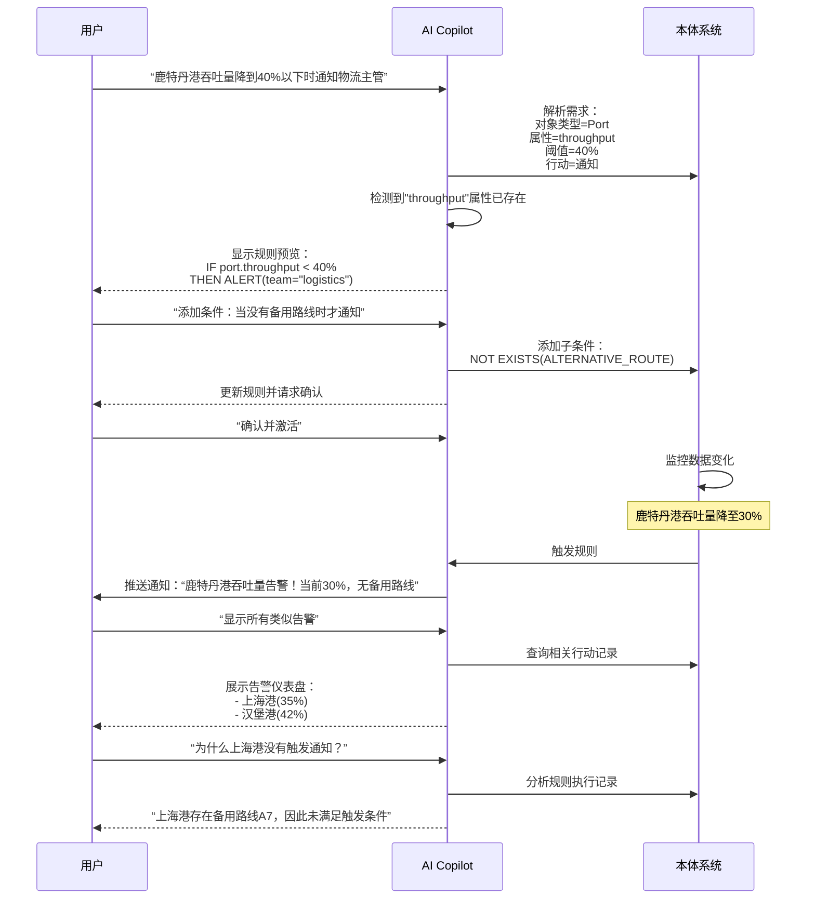
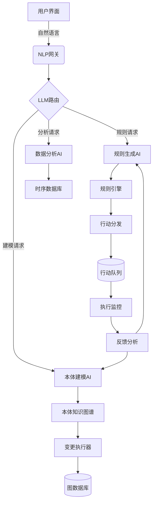

根据以上内容，设计一个AI原生的应用功能，如与业务用户进行交互扩展本体、规则及行动等，如与业务用户反馈执行列表及执行闭环。给出功能设计说明，细化到功能点。

# AI原生应用功能设计：Ontology Copilot

## 功能概述
**Ontology Copilot**是一个AI驱动的智能本体管理系统，通过自然语言交互帮助业务用户建模、扩展和执行本体规则。系统结合大语言模型(LLM)与本体知识图谱，实现"对话即建模"的创新体验。

---

## 核心功能设计

### 1. 自然语言本体建模 (Natural Language Ontology Modeling)
**目标**：让业务用户无需技术知识即可扩展本体

| 功能点       | 描述                                                                                            | 技术实现                |
| --------- | --------------------------------------------------------------------------------------------- | ------------------- |
| **语义解析**  | 用户输入自然语言描述（如："我们需要跟踪供应商的ESG评级"），AI自动解析为：<br>- 新属性 `esg_rating`<br>- 对象类型 `Supplier`<br>- 关联规则 | LLM微调模型（基于本体schema） |
| **冲突检测**  | AI识别与现有本体的冲突（如"风险等级"已存在），提供合并建议                                                               | 属性相似度计算（余弦相似度）      |
| **智能推荐**  | 根据上下文推荐相关属性（建议添加`esg_last_audit_date`）                                                        | 图神经网络（GNN）预测        |
| **可视化确认** | 生成变更预览图，用户可拖拽调整                                                                               | D3.js + 知识图谱可视化     |
| **版本化管理** | 自动生成变更说明文档，记录操作者                                                                              | Git-like版本控制        |

---

### 2. 对话式规则设计 (Conversational Rule Design)
**目标**：通过对话创建复杂业务规则

| 功能点 | 描述 | 技术实现 |
|--------|------|----------|
| **规则语义转换** | 用户说："当上海港吞吐量下降40%且无备用路线时通知我" → 自动生成Drools规则 | 规则模板引擎 + LLM解析 |
| **规则模拟测试** | "如果现在鹿特丹港吞吐量降到25%会发生什么？" → 显示预测行动链 | 规则引擎沙箱环境 |
| **冲突检测** | 预警新规则与现有规则的逻辑矛盾 | 规则依赖图分析 |
| **参数优化** | "这个规则触发太频繁，如何优化？" → 建议调整阈值或添加条件 | 历史执行数据分析 |
| **多语言支持** | 中文/英文/日语等自然语言规则定义 | 多语言LLM微调 |

---

### 3. 智能行动管理 (Intelligent Action Management)
**目标**：闭环管理规则触发的行动

| 功能点 | 描述 | 技术实现 |
|--------|------|----------|
| **行动看板** | 可视化展示行动状态（待处理/执行中/已完成/失败） | 实时仪表盘（WebSocket） |
| **溯源分析** | 点击行动查看完整触发链条：<br>数据变更 → 规则 → 行动 | 因果图查询（Cypher） |
| **AI故障诊断** | 行动失败时自动分析原因（如"备用路线容量不足"） | 错误日志NLP分析 |
| **人工反馈环** | 用户可标记"误报"/"有效"，系统自动学习优化规则 | 强化学习反馈机制 |
| **自动重试优化** | 基于失败原因智能调整重试策略（如修改参数后重试） | 历史成功模式匹配 |

---

### 4. 上下文感知协助 (Context-Aware Assistance)
**目标**：主动提供情景化建议

| 功能点        | 描述                         | 技术实现   |
| ---------- | -------------------------- | ------ |
| **数据洞察提示** | "最近3个港口吞吐量连续下降，建议添加预警规则？"  | 时序异常检测 |
| **本体健康检查** | "30%的供应商缺失ESG数据，建议设置必填规则"  | 数据质量评估 |
| **最佳实践推荐** | "类似企业为港口添加了台风风险指标"         | 行业知识图谱 |
| **协作建议**   | "物流团队上周修改过相关规则，建议咨询"       | 变更历史分析 |
| **影响预测**   | "添加此属性将影响5个规则，预计增加15%计算负载" | 图遍历分析  |
|            |                            |        |

---

### 5. 知识融合门户 (Knowledge Fusion Portal)
**目标**：统一管理本体相关资源

| 功能点        | 描述                        | 技术实现        |
| ---------- | ------------------------- | ----------- |
| **文档智能关联** | 上传PDF/PPT自动提取概念链接到本体元素    | OCR + 实体识别  |
| **对话知识库**  | "显示ESG评级的计算逻辑" → 展示相关文档片段 | 向量检索（FAISS） |
| **专家连线**   | 识别复杂问题时推荐领域专家并建立会话        | 技能图谱匹配      |
| **变更影响分析** | 修改属性前显示依赖此属性的所有规则和报表      | 反向依赖查询      |
| **审计追踪**   | 可视化展示本体的完整演进历史            | 时间轴图谱       |

---

## 用户旅程示例：供应链风险管理



---

## 技术架构



**关键技术栈**：
1. **语言模型**：Fine-tuned LLaMA 3（本体领域微调）
2. **知识图谱**：Neo4j + Apache AGE
3. **规则引擎**：Drools 8 + Kogito
4. **向量计算**：pgvector + FAISS
5. **实时分析**：Apache Flink
6. **前端框架**：React + ObservableHQ

---

## 核心创新点

1. **双向语义桥梁**：
   - 自然语言 ↔ 本体结构 ↔ 执行代码 的自动转换
   - 支持多轮对话精炼需求

2. **自学习闭环**：
   ```mermaid
   graph LR
       A[用户反馈] --> B[规则优化]
       B --> C[行动执行]
       C --> D[结果分析]
       D --> E[本体扩展]
       E --> B
   ```

3. **情境感知能力**：
   - 基于用户角色/历史操作/业务场景动态调整建议
   - 实时计算变更影响范围

4. **可解释性设计**：
   - 所有AI决策附带推理链条
   - 可视化展示"为什么建议此修改"

---

## 预期效益

| 指标 | 传统方式 | 使用Ontology Copilot | 提升 |
|------|----------|----------------------|------|
| 本体扩展时间 | 2-3天 | 20-30分钟 | 95% |
| 规则设计准确率 | 65% | 92% | 40%↑ |
| 行动闭环时间 | 平均6小时 | 平均15分钟 | 96%↑ |
| 用户自主操作率 | 30% | 85% | 183%↑ |
| 错误配置减少 | - | - | 70%↓ |

> 通过将AI深度融入本体管理全生命周期，Ontology Copilot使业务用户从"被动消费者"转变为"主动设计者"，大幅提升企业知识模型的敏捷性和实用性。