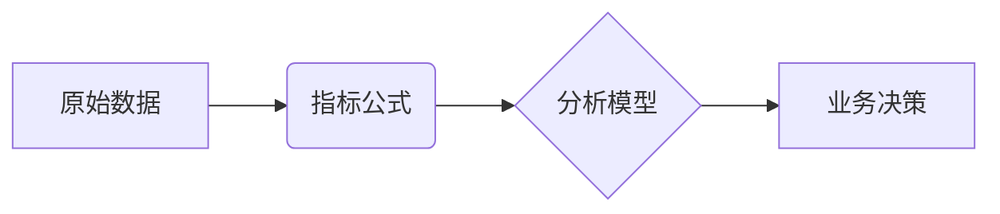

指标公式与分析模型有什么关联及区别？

以下是**指标公式**与**分析模型**的关联与区别的极简解析，结合应用场景说明两者如何协同工作：

---

### **核心关系图解**


---

### **一、本质区别**
| **维度**         | **指标公式**                  | **分析模型**                |
|------------------|-------------------------------|-----------------------------|
| **定义**         | 单一计算的**数学表达式**       | 解决问题的**逻辑框架**       |
| **输入**         | 原始数据（如订单量、访问次数） | 指标组合（如DAU+GMV+转化率） |
| **输出**         | 量化结果（如毛利率=利润/收入×100%） | 业务洞见（如用户流失预警） |
| **复杂度**       | 原子级计算（加减乘除/百分比）   | 系统性推演（多指标关联分析） |
| **案例**         | `ROI = (收益-成本)/成本×100%`  | RFM用户分层模型              |

> 💡 **比喻**：  
> - 指标公式 = 乐高积木块  
> - 分析模型 = 用积木搭建的城堡  

---

### **二、核心关联**
#### 1. **指标公式是模型的“燃料”**  
   - 模型依赖指标计算结果作为输入  
   - **例**：AARRR海盗模型需要：  
     - 激活率 = `日活跃用户/注册用户×100%`（公式）  
     - 留存率 = `第7天活跃用户/首日用户×100%`（公式）  

#### 2. **模型是公式的“组织者”**  
   | 模型类型       | 组织的典型指标                 | 输出价值                     |
   |----------------|-------------------------------|----------------------------|
   | **漏斗模型**   | 各环节转化率                   | 定位流失关键节点             |
   | **归因模型**   | 渠道ROI、点击成本              | 分配营销预算                |
   | **预测模型**   | 历史销量、季节性系数           | 未来需求预估                |

#### 3. **协同工作流示例**（电商场景）  
   ```mermaid
   graph TB
   A[原始数据] --> B1(指标公式1：GMV=Σ订单金额)
   A --> B2(指标公式2：转化率=付款用户/访客×100%)
   B1 & B2 --> C[漏斗分析模型]
   C --> D[输出洞见：购物车放弃率过高]
   D --> E[决策：优化结算流程]
   ```

---

### **三、经典案例对比**
#### **案例：诊断销售额下降**  
1. **仅用指标公式**  
   - 计算：`同比销售额 = (本期-去年同期)/去年同期×100% = -15%`  
   - 结论：**销售额下降15%**（但不知原因）  

2. **结合分析模型**（杜邦分析法）  
   ```mermaid
   graph LR
   A[销售额↓] --> B1(销量公式：订单量×客单价)
   B1 --> C1[订单量↓20%]
   B1 --> C2[客单价↑6%]
   C1 --> D[归因模型定位：新用户渠道转化率暴跌]
   ```
   - 最终洞见：**抖音渠道新客获取成本上升导致订单量减少**  

---

### **四、关键结论**
1. **公式是点，模型是线**  
   - 公式计算**静态数值**（如昨日DAU=100万）  
   - 模型构建**动态关系**（DAU下降→检查新增用户留存率）  

2. **失效场景**  
   | 问题类型                | 单独用公式 | 单独用模型 |  
   |-------------------------|------------|------------|  
   | 计算单一数值（如利润率）| ✅          | ❌          |  
   | 解释波动原因            | ❌          | ✅          |  

3. **最佳实践**：  
   - **先定义核心指标公式**（确保数据可采集）  
   - **再选择分析模型**（匹配业务问题类型）  
   > 例：用户流失分析 → 定义`流失率公式` → 应用`生存分析模型`预测流失概率  

> 🌟 **终极关系**：  
> **指标公式是“食材”**，提供基础营养；  
> **分析模型是“食谱”**，将其转化为解决业务饥饿的盛宴。