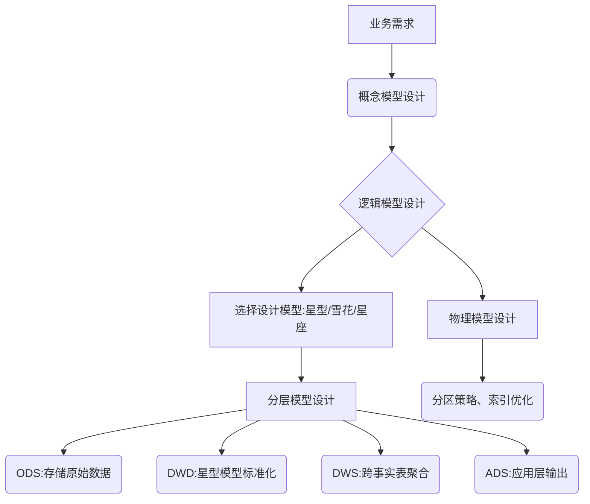

数据仓库设计模型（星型、雪花、星座）与数据仓库数据模型（概念、逻辑、物理）与数据仓库分层模型（ODS、DWD、DWS、ADS）这些有什么关联与区别

---

### **一、三大概念的定义与作用**
#### **1. 数据仓库设计模型（星型、雪花、星座）**
- **是什么**：描述数据表之间的**逻辑关系结构**，解决“如何组织数据表”的问题。
- **作用**：  
  - 定义事实表与维度表的连接方式（星型：直接连接；雪花：层级连接）  
  - 支持特定分析场景（如单业务分析、跨业务分析）  
- **层级归属**：属于**逻辑数据模型**的细化设计。

#### **2. 数据仓库数据模型（概念、逻辑、物理）**
- **是什么**：数据仓库设计的**方法论框架**，分三个阶段定义数据组织形式。  
- **作用**：  
  - **概念模型**：高层业务抽象（如“销售”“库存”实体及关系）  
  - **逻辑模型**：详细设计表结构（字段、主外键、星型/雪花模型选择）  
  - **物理模型**：技术实现（存储引擎、索引、分区策略）  

#### **3. 数据仓库分层模型（ODS、DWD、DWS、ADS）**
- **是什么**：数据仓库的**架构分层**，定义数据从原始到应用的加工流程。  
- **作用**：  
  - **ODS层**：贴源存储原始数据（保持业务系统原貌）  
  - **DWD层**：清洗、标准化数据（构建星型/雪花模型）  
  - **DWS层**：轻度汇总（按主题预聚合指标）  
  - **ADS层**：应用层（直接输出报表或API）  

---

### **二、三大模型的关联与协作**
#### **1. 设计模型与数据模型的关系**  
- **逻辑模型决定设计模型**：  
  在逻辑建模阶段选择星型、雪花或星座模型（如DWD层使用星型模型）。  
- **物理模型实现设计模型**：  
  物理建模时，需根据设计模型优化存储（如为星型模型的事实表建立列式存储）。

#### **2. 数据模型与分层模型的关系**  
- **概念模型指导分层设计**：  
  业务实体（如“客户”“订单”）映射到分层模型的DWD层表。  
- **逻辑模型落地到分层**：  
  - DWD层实现逻辑模型中的星型/雪花结构  
  - DWS层基于逻辑模型预聚合指标（如按地区汇总销售额）  

#### **3. 设计模型与分层模型的结合**  
- **示例**：  
  - **DWD层**：用星型模型存储原子数据（如订单事实表+商品维度表）  
  - **DWS层**：按星座模型跨事实表汇总（如订单+库存事实表关联分析）  

---

### **三、核心区别对照表**
| **维度**         | **设计模型（星型/雪花/星座）**       | **数据模型（概念/逻辑/物理）**       | **分层模型（ODS/DWD/DWS/ADS）**  |  
|-------------------|-------------------------------------|-------------------------------------|----------------------------------|  
| **关注点**        | 表间逻辑关系                        | 数据从抽象到实现的全流程设计          | 数据加工流程与存储层次            |  
| **使用阶段**      | 逻辑建模阶段                        | 全周期（需求分析→技术实现）           | 物理建模与ETL开发阶段             |  
| **输出产物**      | 星型/雪花/星座ER图                  | 概念模型图、逻辑模型DDL、物理表结构    | 分层数据表及数据处理代码           |  
| **典型问题**      | “用星型还是雪花？”                  | “实体如何定义？表结构如何设计？”      | “数据如何分层清洗和聚合？”         |  

---

### **四、实际应用中的协作流程**

#### **示例：电商数仓设计**
1. **概念模型**：识别核心实体（订单、用户、商品）及其关系。  
2. **逻辑模型**：  
   - 选择星型模型（订单事实表 + 用户/商品/时间维度表）  
3. **分层模型**：  
   - **DWD层**：构建订单星型模型  
   - **DWS层**：按用户维度聚合历史订单金额  
   - **ADS层**：生成“高价值用户榜单”报表  
4. **物理模型**：  
   - 订单事实表使用列式存储+按月分区  

---

### **五、总结：三大模型的核心价值**
1. **设计模型（星型/雪花/星座）**：  
   - **解决**：如何高效组织数据表关系以支持分析  
   - **输出**：表结构设计图（如ER图）  

2. **数据模型（概念/逻辑/物理）**：  
   - **解决**：从业务需求到技术实现的全链路设计  
   - **输出**：概念图、表DDL、存储方案  

3. **分层模型（ODS/DWD/DWS/ADS）**：  
   - **解决**：数据从原始到应用的加工流程  
   - **输出**：分层表结构及ETL代码  

**关联本质**：  
- **设计模型**是逻辑模型的具体实现形式  
- **分层模型**是数据模型在物理层的落地架构  
- **三者协同**确保数据仓库**易用、高效、可扩展**。