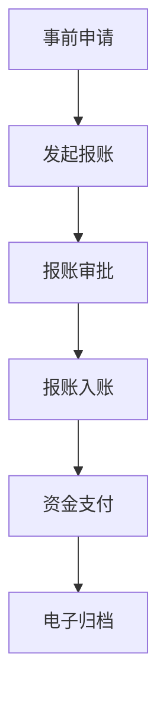
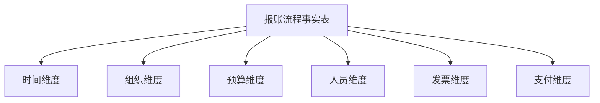

成本费用报账包括事前申请、发起报账、报账审批、报账入帐、资金支付、电子归档这几个过程。设计成本费用报帐资源池，包括了会计凭证、资金支付、预算执行、业票关联等数据。从业务对象、业务过程、业务规则来进行维度建模。简洁明了讲解一步一步设计过程

以下是成本费用报账资源池维度建模的步骤化设计过程，基于业务对象、业务过程、业务规则三个核心维度展开：

---

### **一、明确业务对象与数据范围**
#### 1. 关键业务对象
| 对象          | 描述                          | 数据示例                      |
|---------------|-------------------------------|-----------------------------|
| 报账单        | 费用申请核心载体              | 报账单ID、申请人、部门、金额  |
| 预算科目      | 费用归属的预算项              | 科目编码、年度预算、已执行额  |
| 发票          | 关联的票据证明                | 发票编号、金额、开票日期      |
| 审批流程      | 多级审批路径                  | 审批人、审批状态、审批意见    |
| 支付记录      | 资金实际支付信息              | 支付流水号、支付方式、支付时间|

#### 2. 数据资源池范围
- **核心数据表**：报账申请单、预算执行表、银行支付流水、电子发票池
- **关联关系**：报账单与发票（N:1）、报账单与预算科目（1:1）

---

### **二、定义业务过程与建模粒度**
#### 1. 业务过程拆解


#### 2. 确定事实表类型
- **选择事务事实表**：记录每个关键环节的状态变更
- **粒度**：每个报账单在每个流程节点的操作记录（如审批通过、支付完成）

---

### **三、维度设计（6大核心维度）**
#### 1. 时间维度
| 字段          | 描述                  |
|---------------|-----------------------|
| date_key      | 日期主键（YYYYMMDD）  |
| fiscal_month  | 财年月                |
| is_workday    | 是否工作日            |

#### 2. 组织维度
| 字段          | 描述                  |
|---------------|-----------------------|
| dept_id       | 部门编码              |
| cost_center   | 成本中心              |
| dept_level    | 部门层级（总部/分支） |

#### 3. 预算维度
| 字段          | 描述                  |
|---------------|-----------------------|
| budget_id     | 预算科目编码          |
| budget_type   | 预算类型（刚性/弹性） |
| remain_amount | 当前剩余预算          |

#### 4. 人员维度
| 字段          | 描述                  |
|---------------|-----------------------|
| employee_id   | 员工工号              |
| job_title     | 职级                  |
| approve_level | 审批权限等级          |

#### 5. 支付维度
| 字段          | 描述                  |
|---------------|-----------------------|
| payment_id    | 支付方式编码          |
| bank_name     | 开户行                |
| is_online     | 是否线上支付          |

#### 6. 发票维度
| 字段          | 描述                  |
|---------------|-----------------------|
| invoice_id    | 发票唯一编号          |
| tax_amount    | 税额                  |
| check_status  | 验真状态              |

---

### **四、事实表设计（核心模型）**
#### 1. 报账流程事实表
| 字段             | 类型    | 描述                         |
|------------------|---------|------------------------------|
| application_id   | PK      | 报账单号                     |
| date_key         | FK      | 申请日期                     |
| dept_id          | FK      | 申请部门                     |
| budget_id        | FK      | 预算科目                     |
| employee_id      | FK      | 申请人                       |
| apply_amount     | Decimal | 申请金额                     |
| actual_amount    | Decimal | 最终审批金额                 |
| approval_days    | Int     | 审批耗时（天数）             |
| payment_date     | FK      | 支付完成日期                 |
| status_flag      | String  | 当前状态（审批中/已支付/归档）|

#### 2. 预算执行事实表
| 字段             | 类型    | 描述                         |
|------------------|---------|------------------------------|
| budget_id        | PK      | 预算科目                     |
| date_key         | FK      | 执行日期                     |
| used_amount      | Decimal | 已使用金额                   |
| remaining_quota | Decimal | 剩余可用额度                 |
| freeze_amount    | Decimal | 已申请未支付的冻结金额       |

---

### **五、业务规则映射**
#### 1. 预算控制规则
```sql
-- 在ETL过程中实施硬性约束
CASE 
  WHEN apply_amount > remaining_quota 
  THEN '预算不足，驳回申请'
  ELSE '允许提交'
END AS budget_check
```

#### 2. 审批路由规则
| 金额区间      | 审批层级              | 维度关联字段          |
|---------------|-----------------------|-----------------------|
| <5000元       | 部门经理              | employee.approve_level=1 |
| 5000-50000元  | 部门总监              | employee.approve_level=2 |
| >50000元      | CFO                   | employee.approve_level=3 |

#### 3. 业票关联规则
```python
# 发票校验逻辑示例
def invoice_check(apply_amount, invoice_total):
    if abs(apply_amount - invoice_total) > 0.01:
        raise Exception("报账金额与发票总额不匹配")
    return True
```

---

### **六、模型落地示例**
#### 星型模型结构


#### 关键分析场景
1. **预算执行监控**  
```sql
SELECT 
    b.budget_name,
    SUM(f.actual_amount) AS total_used,
    b.original_amount - SUM(f.actual_amount) AS remaining
FROM fact_application f
JOIN dim_budget b ON f.budget_id = b.budget_id
GROUP BY ROLLUP(b.budget_name)
```

2. **审批效率分析**  
```sql
SELECT 
    d.dept_name,
    AVG(f.approval_days) AS avg_approve_days,
    COUNT(CASE WHEN f.approval_days > 3 THEN 1 END) AS overdue_count
FROM fact_application f
JOIN dim_dept d ON f.dept_id = d.dept_id
GROUP BY d.dept_name
```

---

### **七、实施关键点**
1. **数据血缘追踪**  
   - 通过元数据管理工具记录从原始发票扫描件到事实表字段的完整加工链路

2. **实时预警设计**  
   - 当remaining_quota < budget_amount*0.1时触发邮件预警

3. **历史版本管理**  
   - 使用SCD Type2处理预算科目调整历史（如年度预算修订）

4. **性能优化**  
   - 对date_key、dept_id等常用筛选字段建立组合索引

通过该模型，可实现：
- 报账全流程状态可视化监控
- 预算执行率实时计算
- 异常支付行为自动检测
- 业财数据100%关联追溯