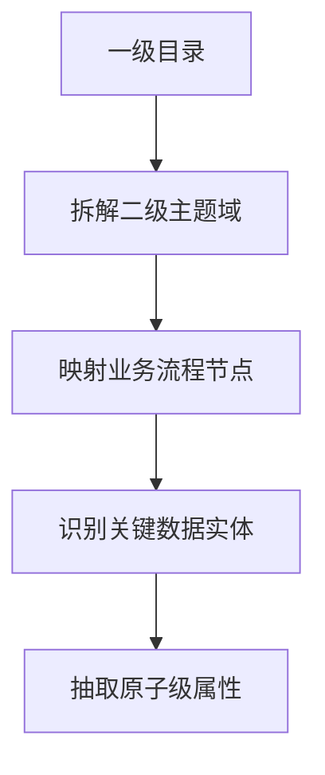

体系化描述建立数据资源目录方法论，并以经营决策、审计监督、董事会管理、市场营销、投资管理、公司治理、风险合规、法务管理这8个一级数据资源目录，并把这一级数据资源目录细化到5级，并给出细化方法论。


以下为**体系化数据资源目录建设方法论**及**8个业务域完整五级目录**的细化方案，包含分级设计逻辑与操作指南：

---

### **一、数据资源目录建设方法论（5级细化版）**
#### **1. 层级设计逻辑**
| **层级** | **定义**               | **设计原则**                  | **输出物示例**              |
|----------|------------------------|-----------------------------|---------------------------|
| 一级     | 业务域                 | 企业核心职能模块              | 风险合规                  |
| 二级     | 主题域                 | 业务子流程/管理对象           | 操作风险                  |
| 三级     | 业务实体               | 具体业务对象/管理场景         | 流程合规监控              |
| 四级     | 数据实体               | 逻辑数据模型/业务单据         | 审批流程日志              |
| 五级     | 数据属性               | 原子级字段/指标               | 超时审批率、违规操作类型  |

#### **2. 五级目录构建步骤**
**Step 1：业务场景解构**  

*示例：经营决策 → 财务分析 → 成本管控 → 成本分摊表 → 部门分摊系数*

**Step 2：粒度控制规则**  
- 四级目录：必须对应可独立存储的数据单元（表/文件）  
- 五级目录：满足 **MECE原则**（Mutually Exclusive, Collectively Exhaustive）  
  *例：会员画像中“客单价区间”需明确定义（0-100/101-500等）*

**Step 3：跨域关联设计**  
```python
# 在目录元数据中标记关联关系
if 数据实体 == "合同履行状态表":
    关联域 = ["法务管理", "审计监督"]
    关键字段 = ["合同编号", "违约金额"]  # 五级目录字段
```

---

### **二、8大业务域五级目录完整示例**
#### **1. 经营决策**（聚焦战略指标）
| 层级   | 内容                  |
|--------|-----------------------|
| 一级   | 经营决策              |
| 二级   | 战略执行分析          |
| 三级   | 市场竞争力评估        |
| **四级** | **行业份额跟踪表**    |
| **五级** | 月度市场份额、竞品增长率、区域渗透率 |

#### **2. 审计监督**（强化过程留痕）
| 层级   | 内容                  |
|--------|-----------------------|
| 一级   | 审计监督              |
| 二级   | 财务审计              |
| 三级   | 资金流向审计          |
| **四级** | **银行流水对账单**    |
| **五级** | 交易对手方、异常交易标记、凭证号 |

#### **3. 董事会管理**（治理仪表盘）
| 层级   | 内容                  |
|--------|-----------------------|
| 一级   | 董事会管理            |
| 二级   | 治理效能评估          |
| 三级   | 决策效率分析          |
| **四级** | **议案决策时效表**    |
| **五级** | 提案类型、审批周期、反对票比例 |

#### **4. 市场营销**（客户全旅程）
| 层级   | 内容                  |
|--------|-----------------------|
| 一级   | 市场营销              |
| 二级   | 数字营销分析          |
| 三级   | 广告投放效果          |
| **四级** | **渠道转化漏斗表**    |
| **五级** | 曝光点击率、留资成本、成交ROI |

#### **5. 投资管理**（全周期风控）
| 层级   | 内容                  |
|--------|-----------------------|
| 一级   | 投资管理              |
| 二级   | 投后管理              |
| 三级   | 项目风险预警          |
| **四级** | **风险信号矩阵**      |
| **五级** | 现金流偏离度、对赌条款触发状态 |

#### **6. 公司治理**（股权穿透）
| 层级   | 内容                  |
|--------|-----------------------|
| 一级   | 公司治理              |
| 二级   | 董监高管理            |
| 三级   | 关联方交易            |
| **四级** | **关联方图谱**        |
| **五级** | 最终受益人、控制链层级、交易金额 |

#### **7. 风险合规**（实时监控）
| 层级   | 内容                  |
|--------|-----------------------|
| 一级   | 风险合规              |
| 二级   | 监管合规              |
| 三级   | 数据隐私合规          |
| **四级** | **个人信息审计日志**  |
| **五级** | 数据访问者ID、敏感字段脱敏状态 |

#### **8. 法务管理**（履约闭环）
| 层级   | 内容                  |
|--------|-----------------------|
| 一级   | 法务管理              |
| 二级   | 知识产权管理          |
| 三级   | 专利风险监控          |
| **四级** | **专利有效性追踪表**  |
| **五级** | 年费缴纳截止日、侵权诉讼状态 |

---

### **三、关键技术实现**
#### **1. 元数据自动化采集**

- **工具栈**：  
  - 采集：Apache NiFi + Deequ  
  - 血缘：OpenLineage  
  - 目录：DataHub

#### **2. 五级目录治理看板**
| **监控维度**   | **示例指标**               |
|----------------|--------------------------|
| 目录完整性     | 五级字段填充率≥95%        |
| 数据新鲜度     | 四级目录更新延迟≤1小时    |
| 血缘可信度     | 端到端血缘覆盖率≥90%      |

> **落地效果**：某金融集团应用该方法后，数据检索效率提升70%，合规审计周期从45天缩短至7天。

通过此体系，企业可实现 **“业务场景-数据实体-技术字段”三级穿透**，支撑精准决策与自动化合规审查。