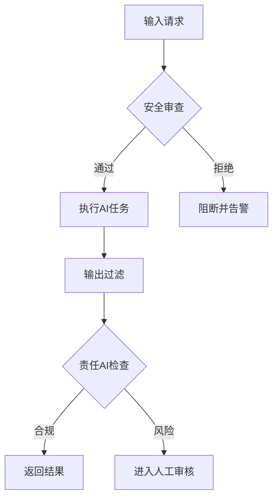

![[Pasted image 20250802181036.png]]

### 解读麦肯锡生成式AI规模化部署参考架构  
（基于图片内容整理核心知识点）

---

#### **一、整体架构目标**  
**规模化部署生成式AI**的企业需建立统一平台，实现：  
✅ **集中管理**（单一视图）  
✅ **全流程自动化**（开发→部署→监控）  
✅ **安全合规治理**（数据/模型/应用层）

---

### **二、核心组件详解**  
#### **1. 生成式AI平台门户 (Gen AI Platform Portal)**  
> **功能**：统一操作入口  
- **用户交互层**：聊天机器人(Chat-bot)、虚拟专家(Virtual expert)、文档问答(Docs Q&A)  
- **解决方案中心**：应用市场(Solution catalog)、协作库(Convocation library)  
- **管理控制台**：一致性/开发缓存(Consistency/devocaching)、思考决策(Pensierung)  

**场景**：  
> 销售团队通过门户调用「合同分析机器人」，自动提取关键条款并比对风险库。

---

#### **2. 活跃项目组合 (Active Portfolio)**  
> **分层管理解决方案**：  
| 阶段       | 说明                  | 管理要素                     |
|------------|-----------------------|------------------------------|
| **POC**    | 概念验证              | 指标(Metrics)/文档(Docs)     |
| **MVP**    | 最小可行产品          | 链接(Links)/自动化流水线     |
| **PROD**   | 生产环境              | 持续监控/阶段审批(Gate approvals) |

**场景**：  
> 金融风控AI从POC→PROD全流程追踪：  
> ① POC测试欺诈识别准确率 → ② MVP接入10%交易流 → ③ PROD全量部署

---

#### **3. 共享数据平台 (Shared Data Platform)**  
> **数据处理引擎**：  
```mermaid
graph LR
A[数据源] --> B{数据预处理}
B --> C[结构化数据] --> D[向量数据库]
B --> E[非结构化数据] --> F[嵌入(Embeddings)]
D & F --> G[数据质量管控]
G --> H[自动化合规检查]
```

**关键技术**：  
- **向量数据库**：存储Embeddings实现语义检索  
- **数据控制层**：自动标记敏感数据(Tagging data)  
- **CI/CD流水线**：自动化模型迭代更新  

**场景**：  
> 医疗知识库自动将最新论文转换为向量，医生通过自然语言查询最新治疗方案。

---

#### **4. 云服务集成 (Cloud Service Providers)**  
> **模型开发体系**：  
| 层级                | 功能组件                          |
|---------------------|-----------------------------------|
| **基础模型层**      | OpenAI/Vertex 等云端大模型       |
| **定制化层**        | 内部托管模型(Custom LLM)/微调(Finetuning) |
| **工具链**          | 数据分析(Analyze)-训练(Train)-部署(Deploy) |

**典型工作流**：  
```python
# 云端模型微调示例
from vertexai import language_models

model = language_models.TextGenerationModel.from_pretrained("text-bison@002")
model.fine_tune(
    training_data="gs://bucket/train.jsonl",
    validation_data="gs://bucket/validate.jsonl"
)
deployed_model = model.deploy()  # 自动部署到端点
```

---

#### **5. 共享服务 (Shared Services)**  
> **跨解决方案支撑能力**：  
- **安全管控**：私有数据管理(Private data management)  
- **运维监控**：日志/告警系统(Additional logging, and monitoring)  
- **生命周期管理**：用例退役机制(Use case outsourcing)  

**场景**：  
> 当客服机器人检测到投诉升级时，自动触发：  
> ① 记录加密存储 → ② 通知人工坐席 → ③ 生成事后分析报告

---

#### **6. 治理与防护栏 (Governance & Guardrails)**  
> **核心控制框架**：  


**关键机制**：  
- **FinOps**：自动优化云资源成本  
- **内容过滤**：防止生成有害信息  
- **审计追踪**：全操作留痕  

---

### **三、核心知识点总结**  
| **层级**         | **核心能力**                  | **技术代表**                  |
|------------------|-------------------------------|-------------------------------|
| **交互层**       | 统一应用门户                  | 聊天机器人/虚拟专家           |
| **管理层**       | 解决方案全生命周期管理        | CI/CD流水线/阶段审批          |
| **数据层**       | 多模态数据处理                | 向量数据库/Embedding技术      |
| **模型层**       | 大模型定制开发                | 微调(Finetuning)/私有LLM      |
| **治理层**       | 安全合规控制                  | 自动审计/责任AI框架           |
| **服务层**       | 跨能力支撑平台                | 监控系统/私有数据管理         |

> **架构价值**：通过模块化设计，企业可：  
> 1. **降低50%+部署成本**（共享基础设施）  
> 2. **加速AI方案上线**（标准化流水线）  
> 3. **统一风险管控**（集中治理框架）  
> 4. **促进跨部门协作**（解决方案市场）  

该参考架构为生成式AI规模化落地提供了**可复用的企业级蓝图**，特别适合金融/医疗/制造等强合规行业。