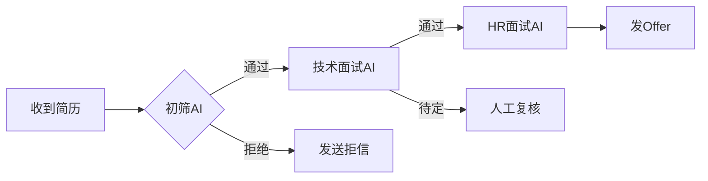
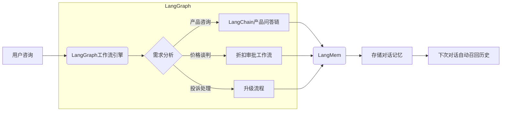

langchain、langmem、langgraph这些框架或工具是什么？具体有什么区别，各举出场景用例，简单易懂明了

下面我用清晰对比的方式解释 **LangChain、LangGraph、LangMem** 三大框架的区别和用途，附场景案例，帮你快速掌握：

---

### **核心定位对比表**
| 框架       | 核心功能                  | 类比比喻           | 适用场景              |
|------------|--------------------------|--------------------|-----------------------|
| **LangChain** | 构建AI应用的基础链条      | **乐高底板**       | 简单线性任务处理      |
| **LangGraph** | 创建复杂状态工作流        | **流程图设计器**   | 多步骤/循环/协作任务  |
| **LangMem**   | 长期记忆管理              | **智能笔记本**     | 需记忆的持续对话      |

---

### **一、LangChain：AI应用的基础框架**
> **核心思想**：把大模型、工具、记忆等组件像乐高积木一样连接起来

#### 关键能力：
1. **链式调用（Chains）**：线性组合多个步骤  
   ```python
   # 示例：简单问答链
   chain = prompt | llm | output_parser
   ```
2. **工具集成（Tools）**：连接搜索/计算器等外部工具
3. **基础记忆（Memory）**：短期对话记忆（上下文窗口）

#### 典型场景：客户服务问答机器人
```python
from langchain.chains import LLMChain

# 1. 定义工具
tools = [CalculatorTool(), ProductSearchTool()]

# 2. 创建链
service_chain = LLMChain(
    llm=llm,
    prompt=customer_service_prompt,
    memory=ConversationBufferMemory()  # 短期记忆
)

# 3. 执行
response = service_chain.run("我的订单号123为什么还没发货？")
```
> ✅ **适合**：订单查询、产品问答等**线性任务**

---

### **二、LangGraph：复杂工作流引擎**
> **核心思想**：用图（Graph）结构描述多步骤、带分支/循环的工作流

#### 关键能力：
1. **节点（Nodes）**：执行单元（LLM调用/工具使用）
2. **边（Edges）**：控制流程走向（条件分支/循环）
3. **状态管理（State）**：跨节点传递数据

#### 典型场景：智能招聘审核系统

```python
from langgraph.graph import StateGraph

# 定义状态
class RecruitmentState(TypedDict):
    resume: str
    decision: str

# 构建图
graph = StateGraph(RecruitmentState)

# 添加节点
graph.add_node("initial_screen", screen_agent)
graph.add_node("tech_interview", tech_agent)
graph.add_node("hr_interview", hr_agent)

# 设置边
graph.add_conditional_edges(
    "initial_screen",
    lambda state: "tech_interview" if state["pass"] else "reject"
)
graph.add_edge("tech_interview", "hr_interview")

# 编译执行
app = graph.compile()
result = app.invoke({"resume": resume_text})
```
> ✅ **适合**：多步骤审核、迭代创作等**非线流程**

---

### **三、LangMem：长期记忆管家**
> **核心思想**：突破上下文限制，实现永久记忆存储和检索

#### 关键能力：
1. **向量记忆库**：将记忆转换为向量存储
2. **相关性检索**：自动召回相关历史记忆
3. **记忆摘要**：压缩关键信息

#### 典型场景：个性化心理辅导助手
```python
from langmem import LangMem

# 初始化记忆库
memory = LangMem(
    vector_store=ChromaDB(),
    summarizer_llm=summarizer_model
)

# 记忆存储
memory.store(
    user_id="user123",
    text="患者提到童年时有过被欺凌经历，导致社交恐惧",
    metadata={"date": "2024-07-20"}
)

# 记忆检索（自动关联当前对话）
session_memory = memory.retrieve(
    query="为什么我害怕参加聚会？",
    user_id="user123",
    top_k=3  # 返回最相关的3条记忆
)
```
> ✅ **适合**：心理辅导、医疗诊断等**需历史记忆的场景**

---

### **三大框架协作实战：智能销售系统**


**代码整合示例**：
```python
# LangGraph 作为主调度
sales_graph = StateGraph(SalesState)

# LangChain 处理标准化环节
sales_graph.add_node("product_qa", 
    LangChainAgent(product_qa_chain))

# LangMem 集成
memory = LangMem(...)

def memory_enricher(state):
    # 从记忆库召回历史
    history = memory.retrieve(state["user_query"], user_id=state["user_id"])
    state["memory_context"] = history
    return state

sales_graph.add_node("enrich_memory", memory_enricher)

# 工作流设计
sales_graph.add_edge("enrich_memory", "product_qa")
```

---

### **总结：如何选择？**
| 需求特点                  | 推荐框架    | 示例场景                  |
|---------------------------|-------------|---------------------------|
| 简单问答/单次工具调用      | LangChain   | 客服机器人、文档摘要       |
| 多步骤/分支/循环流程       | LangGraph   | 审批系统、多Agent协作      |
| 需要持久化记忆             | LangMem     | 心理辅导、个性化推荐       |
| 复杂企业级应用             | **三件套组合** | 智能销售、医疗诊断系统     |

> 🔥 **关键洞察**：  
> - LangChain 是**基础积木**  
> - LangGraph 是**流程设计器**  
> - LangMem 是**记忆中枢**  
> 现代AI应用通常需要三者配合使用！