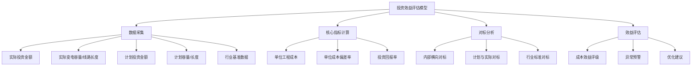

给出上述附件需求中投资效益评估的评估模型，详细描述评估过程

# 一、deepseek

## 评估模型概述

根据需求文档中的投资效益评估要求，我设计了以下评估模型：



## 详细评估过程

### 1. 数据采集阶段

**数据来源：**
- 实际投资金额 → 财务中台智慧竣工决算应用
- 计划投资金额 → 财务中台投资预算应用
- 实际变电容量/线路长度 → 发展部网上电网
- 计划变电容量/线路长度 → 项目计划文档
- 行业基准数据 → 电力行业数据库

**数据预处理：**
- 统一计量单位（万元、MVA、公里）
- 按电压等级分组（500kV, 220kV, 110kV等）
- 区分工程类型（变电工程、线路工程）

### 2. 核心指标计算

#### (1) 单位工程成本计算
```
变电工程单位成本 = 实际投资金额 / 实际变电容量 (万元/MVA)
线路工程单位成本 = 实际投资金额 / 实际线路长度 (万元/公里)
```

#### (2) 单位成本偏差率
```
偏差率 = (实际单位成本 - 计划单位成本) / 计划单位成本 × 100%
```

#### (3) 投资回报率（简化版）
```
ROI = (计划收益 - 实际投资) / 实际投资 × 100%
```

### 3. 对标分析

**三维对标体系：**


#### (1) 内部横向对标
- 同电压等级项目比较
- 同区域项目比较
- 同期建设项目比较

#### (2) 计划与实际对标
- 实际单位成本 vs 计划单位成本
- 实际工程量 vs 计划工程量
- 实际工期 vs 计划工期

#### (3) 行业标准对标
- 与行业平均单位成本比较
- 与行业先进水平比较
- 与国家标准比较

### 4. 效益评估与输出

**评估矩阵：**

| 偏差率范围   | 成本效益评级 | 预警级别 | 处理建议 |
|-------------|------------|---------|---------|
| ≤ -10%      | 优秀 ★★★★   | 无      | 总结经验推广 |
| -10% ~ -5%  | 良好 ★★★    | 低      | 保持监控 |
| -5% ~ +5%   | 达标 ★★     | 中      | 优化空间 |
| +5% ~ +10%  | 一般 ★      | 高      | 分析原因 |
| > +10%      | 较差        | 严重    | 专项整改 |

**异常预警机制：**
1. 单位成本超过行业平均15% → 黄色预警
2. 单位成本超过行业平均25% → 红色预警
3. 偏差率>10% → 自动生成分析任务
4. 投资回报率<5% → 效益评估预警

## 模型实施流程

```mermaid
sequenceDiagram
    财务系统->>数据仓库： 提取决算数据
    工程系统->>数据仓库： 提供工程量数据
    行业数据库->>数据仓库： 提供基准数据
    数据仓库->>分析引擎： 执行单位成本计算
    分析引擎->>对标系统： 进行三维对标
    对标系统->>评估模型： 生成效益评级
    评估模型->>预警系统： 触发异常预警
    预警系统->>管理看板： 展示评估结果
```

## 模型优势

1. **多维度分析**：电压等级、工程类型、区域、时间多维度评估
2. **动态基准**：行业基准数据每季度更新，保持评估时效性
3. **预警联动**：自动触发不同级别预警和后续处理流程
4. **溯源分析**：支持从结果追溯到原始数据，便于问题定位
5. **可视化输出**：自动生成热力图、趋势图等可视化报告

## 应用场景示例

**案例：** 220kV变电站新建项目评估

1. 数据采集：
   - 实际投资：8,200万元
   - 实际变电容量：240MVA
   - 计划投资：7,500万元
   - 计划容量：250MVA
   - 行业平均：32万元/MVA

2. 指标计算：
   - 实际单位成本 = 8,200/240 = 34.17万元/MVA
   - 计划单位成本 = 7,500/250 = 30万元/MVA
   - 偏差率 = (34.17-30)/30×100% = +13.9%

3. 对标分析：
   - 与计划比较：+13.9%（超出阈值）
   - 与行业比较：34.17 vs 32（高出6.8%）
   - 区域同类型项目比较：排名后20%

4. 效益评估：
   - 成本效益评级：较差
   - 预警级别：严重（红色）
   - 触发专项分析：发现主要原因为设计变更增加成本

该模型通过系统化的数据采集、科学的指标计算和多维度的对标分析，为工程项目投资效益评估提供了全面、客观的量化工具，有助于企业优化投资决策和提高工程效益。

# 二、Qwen

好的，根据您提供的《工程项目执行多维精益场景》文档中的内容，针对“投资效益评估”模块下的“单位工程成本对标”指标，我为您详细描述其评估模型和评估过程。

**评估模型名称：** 单位工程成本对标模型

**核心目标：**
通过计算和对比实际单位成本与预算（概算）单位成本、以及历史/标杆单位成本，评估单个工程项目的成本效益和成本控制水平，识别成本异常项目，为精细化管理和决策提供数据支持。

**评估过程详细描述：**

1.  **数据准备与筛选：**
    *   **项目范围：** 明确评估对象为“主网基建项目”。
    *   **项目分解：** 将主网基建项目进一步细分为“变电单体工程”和“线路单体工程”，因为两者的成本构成和计量单位不同。
    *   **数据来源：**
        *   **决算金额 (实际投资金额):** 从“财务中台智慧竣工决算应用”获取。这是计算实际单位成本的分子。
        *   **概算金额 (预算投资金额):** 从“财务中台投资预算应用”获取。这是计算预算单位成本的分子。
        *   **实际工程量 (变电容量/线路长度):** 从“发展部网上电网”获取项目的实际建成规模（实际变电容量或实际线路长度）。这是计算实际单位成本的分母。
        *   **计划工程量 (预计变电容量/线路长度):** 从“发展部网上电网”或“财务中台投资预算应用”获取项目可研/初设阶段的预计规模。这是计算预算单位成本的分母。
        *   **电压等级:** 从“项目基础信息”获取。用于将项目分组，进行同等级别的对标分析。
        *   **单位:** 明确单位，通常变电成本单位为“元/万千伏安（元/MW）”或“万元/万千伏安（万元/MW）”，线路成本单位为“元/公里（元/km）”或“万元/公里（万元/km）”。

2.  **计算核心指标：**
    *   **实际单位成本 (Actual Unit Cost):**
        *   对于变电单体工程：`实际单位成本 (元/MW) = 该项目的实际决算金额 / 该项目的实际变电容量 (MW)`
        *   对于线路单体工程：`实际单位成本 (元/km) = 该项目的实际决算金额 / 该项目的实际线路长度 (km)`
    *   **预算（概算）单位成本 (Budgeted/Estimated Unit Cost):**
        *   对于变电单体工程：`预算单位成本 (元/MW) = 该项目的概算金额 / 该项目的预计（概算）变电容量 (MW)`
        *   对于线路单体工程：`预算单位成本 (元/km) = 该项目的概算金额 / 该项目的预计（概算）线路长度 (km)`

3.  **对标分析与评估：**
    *   **内部对标 (计划 vs. 实际):**
        *   **计算偏离度:** `单位成本偏离度 (%) = (实际单位成本 - 预算单位成本) / 预算单位成本 * 100%`
        *   **评估:** 分析每个单体工程的偏离度。正偏离（实际 > 预算）表示成本超支，负偏离（实际 < 预算）表示成本节约。设定阈值（例如 ±10% 或 ±15%），对偏离度超过阈值的项目进行标记和预警。
    *   **外部/横向对标 (与平均水平/标杆对比):**
        *   **计算平均单位成本:** 按照“单位”（如电压等级、项目类型等）对所有已决算的同类单体工程的实际单位成本进行统计，计算出平均值或中位数。
        *   **计算偏离度:** `与平均值偏离度 (%) = (某项目的实际单位成本 - 同类项目平均单位成本) / 同类项目平均单位成本 * 100%`
        *   **评估:** 识别实际单位成本显著高于（或低于）同类项目平均水平的项目。这有助于发现成本控制优秀或异常的案例。

4.  **预警触发（关联预警分析模块）：**
    *   根据计算出的“实际单位成本”和“预算单位成本”以及它们之间的偏离度，自动触发“单位成本预警”。
    *   预警逻辑可能包括：
        *   实际单位成本显著高于预算单位成本（例如，超出预估的一定百分比）。
        *   实际单位成本显著高于同类项目的平均水平或标杆水平。
        *   结合项目其他信息（如规模、复杂度）进行综合判断后的异常预警。

5.  **结果输出与应用：**
    *   **生成报告/看板:** 将各单体工程的单位成本、预算单位成本、偏离度等关键指标以表格、图表（如柱状图、散点图）等形式展示。
    *   **识别重点:** 突出显示成本偏离度大、预警的项目，供管理层和项目团队关注。
    *   **驱动改进:** 为项目后评价、可研初设优化、招投标策略调整、施工管理改进等提供数据支撑，以提升未来项目的投资效益和成本控制水平。

通过这个评估模型和过程，可以量化地衡量工程项目在单位成本方面的表现，及时发现成本管理中的问题，并为持续改进提供依据。