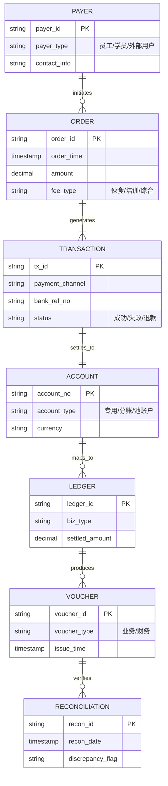

1从数据架构角度，抽取共性数据架构模型；2从应用架构角度，抽取共性应用服务。

基于三类收费业务的流程图和核心逻辑，从数据架构和应用架构角度抽取共性模型如下：

---

### **一、数据架构：共性数据模型**
#### **核心数据实体**


#### **关键数据关系**
1. **缴费主线**  
   `缴费人 → 订单 → 交易流水 → 账户`  
   （例：员工创建伙食费订单 → 生成微信支付流水 → 入账伙食子账户）

2. **凭证主线**  
   `账户 → 业务台账 → 业务凭证 + 财务凭证`  
   （例：培训费账户 → 生成班级收费台账 → 触发电子发票+记账凭证）

3. **对账闭环**  
   `交易流水 + 业务台账 + 银行账单 → 对账记录`  
   （三方数据碰撞验证一致性）

---

### **二、应用架构：共性应用服务**
#### **1. 支付引擎服务 (Payment Engine)**
- **功能**：统一支付接入
- **共性能力**：
  - 支付渠道路由（微信/支付宝/银联）
  - 交易流水生成（全业务通用流水号规则）
  - 手续费计算（按业务类型差异化）
- **业务调用示例**：
  ```python
  # 所有业务统一调用
  def create_payment(order_id, fee_type, amount):
      tx_id = generate_tx_id(fee_type)  # 生成标准流水号
      channel = route_channel(fee_type) # 自动选支付渠道
      return {tx_id, channel}
  ```

#### **2. 账户服务 (Account Service)**
- **功能**：资金账户管理
- **共性能力**：
  - 账户开立/绑定（专用商户号/培训账户/分账池）
  - 自动分账路由（综合业务资金拆分）
  - 余额实时查询
- **核心接口**：
  ```java
  // 账户分配接口（三类业务共用）
  public Account assignAccount(String feeType) {
      if (feeType.equals("伙食费")) 
          return getSpecialAccount("MEAL");
      else if (feeType.equals("培训费"))
          return getTrainingAccount();
      else 
          return splitPoolAccount(); // 综合业务分账
  }
  ```

#### **3. 凭证服务 (Voucher Service)**
- **功能**：多层级凭证生成
- **共性能力**：
  - 业务凭证生成（电子收据/发票）
  - 财务凭证对接（用友/金蝶凭证接口）
  - 凭证关联查询（按流水号追溯）
- **处理逻辑**：
  ```mermaid
  graph TB
    A[交易流水] --> B{凭证类型}
    B -->|业务凭证| C[生成电子收据/发票]
    B -->|财务凭证| D[调用财务系统制证API]
    C & D --> E[存储凭证关联关系]
  ```

#### **4. 对账服务 (Reconciliation Service)**
- **功能**：多维度对账
- **共性能力**：
  - 自动获取银行流水
  - 三端数据匹配（业务台账 vs 财务凭证 vs 银行流水）
  - 差异预警（短信/邮件通知）
- **对账规则引擎**：
  ```sql
  /* 通用对账SQL逻辑 */
  SELECT 
      t.tx_id, 
      l.amount AS ledger_amt,
      b.amount AS bank_amt,
      CASE WHEN l.amount = b.amount THEN '匹配' 
           ELSE '差异' END AS status
  FROM transactions t
  JOIN ledgers l ON t.tx_id = l.tx_id
  JOIN bank_statements b ON t.bank_ref_no = b.ref_no
  WHERE t.biz_date = '2023-08-04'
  ```

#### **5. 元数据服务 (Metadata Service)**
- **功能**：业务规则配置
- **共性能力**：
  - 费种管理（伙食/培训/其他配置）
  - 渠道参数配置（费率/限额）
  - 分账规则引擎（综合业务专用）
- **配置表示例**：
  | 业务类型 | 账户类型 | 分账比例 | 凭证模板 |
  |----------|----------|----------|----------|
  | 伙食费 | 专用商户号 | 100%主账户 | 电子收据 |
  | 培训费 | 专用账户 | 100%主账户 | 电子发票 |  
  | 综合收费 | 分账池 | 伙食费30%<br>培训费70% | 分拆凭证 |

---

### **三、架构共性总结**
| **架构维度** | **伙食/培训业务**              | **综合业务**                  | **共性抽象**               |
|--------------|------------------------------|------------------------------|--------------------------|
| **数据模型** | 单一账户型                    | 分账池型                     | 统一交易流水实体         |
| **支付服务** | 简单支付路由                  | 复杂分账引擎                 | 标准化支付接口           |
| **凭证服务** | 单层凭证生成                  | 多层凭证拆分                 | 凭证关联元模型           |
| **对账服务** | 基础三端核对                  | 多科目交叉验证               | 差异检测核心算法         |
| **扩展性**   | 垂直业务扩展                  | 水平业务集成                 | 元数据驱动配置           |

> 💡 **架构设计启示**：  
> 1. **标准化交易流水**是打通三类业务的数据枢纽  
> 2. **支付/账户/凭证**服务可沉淀为平台级能力  
> 3. **综合业务**=基础服务+分账引擎+规则配置