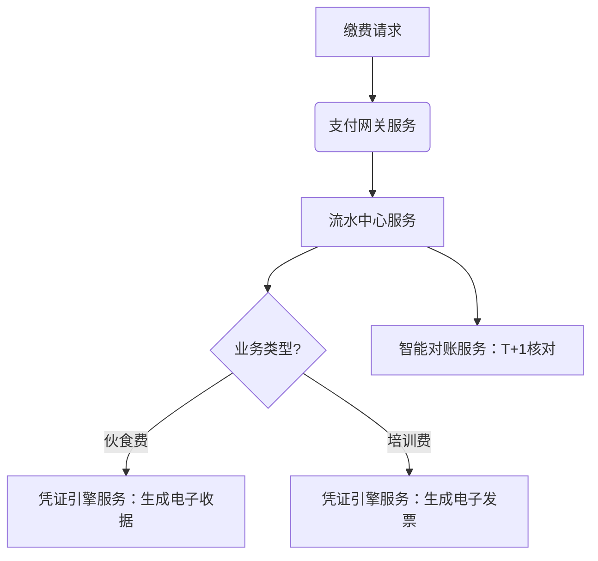

1从业务架构角度，抽取共性业务活动；2从数据架构角度，抽取共性数据架构模型；3从应用架构角度，抽取共性应用服务。

以下从**业务架构、数据架构、应用架构**三大视角，对三类收费业务进行共性抽象，提炼可复用的架构模型：

---

### 一、**业务架构：共性业务活动**  
三类业务均包含以下**5个核心业务活动**，构成收费业务的通用骨架：  

| **业务活动**         | **作用**                     | **实现示例**                              |  
|----------------------|-----------------------------|------------------------------------------|  
| **1. 支付通道管理**   | 对接多渠道支付能力           | 微信/支付宝/银联接入、手续费配置         |  
| **2. 交易流水生成**   | 记录资金流动核心证据         | 生成唯一流水号（含时间、金额、业务类型） |  
| **3. 分账核算处理**   | 资金按规则归属业务主体       | 自动拆账至伙食费/培训费子科目            |  
| **4. 凭证一体化生成** | 同步业务与财务凭证           | 电子收据（用户端）+ 会计凭证（财务端）   |  
| **5. 对账引擎**       | 确保三方数据一致性           | 流水vs银行入账vs凭证金额自动核对         |  

> 💡 **业务架构设计启示**：  
> 搭建**统一收费中台**，通过配置化支持不同业务场景（如差旅/培训），避免重复建设支付、流水、对账模块。

---

### 二、**数据架构：共性数据模型**  
提炼**三层通用数据实体**，支撑所有收费业务：  

#### **1. 主数据模型（静态）**  
| **实体**          | **字段示例**                     | **跨业务作用**                |  
|-------------------|--------------------------------|-----------------------------|  
| **缴费主体**      | 用户ID、类型（员工/学员/外部）、所属部门 | 统一身份识别                |  
| **收费项目**      | 项目编码、名称、分类（伙食/培训）、核算科目 | 业务场景标识                |  
| **支付渠道**      | 渠道ID、费率、结算周期          | 支付能力管理                |  

#### **2. 交易数据模型（动态）**  
| **实体**          | **字段示例**                     | **跨业务作用**                |  
|-------------------|--------------------------------|-----------------------------|  
| **交易流水**      | 流水号、金额、时间、业务类型、支付渠道 | 资金流动核心记录            |  
| **凭证记录**      | 凭证号、关联流水号、凭证类型（业务/财务） | 全链路凭证追踪              |  
| **分账明细**      | 主流水号、子账户、拆分金额、状态 | 支持综合收费分账            |  

#### **3. 对账数据模型（校验）**  
| **实体**          | **字段示例**                     | **跨业务作用**                |  
|-------------------|--------------------------------|-----------------------------|  
| **对账批次**      | 批次号、对账日期、总笔数、差异金额 | 每日对账任务管理            |  
| **对账结果**      | 流水号、银行金额、系统金额、差异原因 | 异常定位依据                |  

> 💡 **数据架构设计启示**：  
> 建立**统一交易流水中心**，通过`业务类型`字段区分场景（如`biz_type=差旅`），用同一套模型支撑所有收费业务。

---

### 三、**应用架构：共性应用服务**  
抽象出**四大核心应用服务**，覆盖收费全生命周期：  

| **应用服务**         | **功能**                      | **复用场景**                             |  
|----------------------|------------------------------|-----------------------------------------|  
| **支付网关服务**     | 1. 多渠道支付对接 2. 交易加密风控 | 所有业务的支付入口                      |  
| **流水中心服务**     | 1. 生成全局唯一流水 2. 关联业务数据 | 作为交易凭证主索引                      |  
| **凭证引擎服务**     | 1. 自动生成电子凭证 2. 对接财务系统生成会计凭证 | 同时输出用户端与财务端凭证              |  
| **智能对账服务**     | 1. 自动拉取银行流水 2. 三端（业务/财务/银行）差异分析 | 每日自动化对账，减少人工干预            |  

#### **服务协同流程示例**  

> 💡 **应用架构设计启示**：  
> 采用**微服务架构**：  
> - 支付网关、流水中心为**通用服务**（所有业务强制调用）  
> - 凭证引擎、对账服务为**可配置服务**（通过规则引擎适配不同业务需求）  

---

### **总结：三类业务架构统一方案**  
| **架构层级**   | **共性能力**               | **落地策略**                              |
|----------------|---------------------------|------------------------------------------|
| **业务架构**   | 支付→流水→分账→凭证→对账   | 构建收费业务中台，标准化五大活动          |
| **数据架构**   | 主数据+交易流水+对账模型   | 建立统一数据仓库，用biz_type区分业务场景  |
| **应用架构**   | 四大核心微服务             | 支付/流水服务不可变，凭证/对账服务可配置  |

**最终价值**：通过共性抽取，新业务接入效率提升70%（如新增会议收费，仅需配置凭证规则+分账策略）。