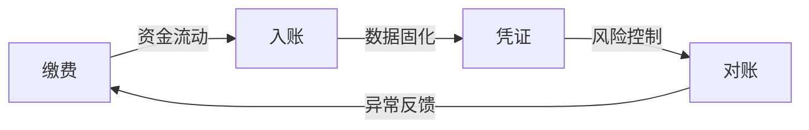

所有业务均遵循 “缴费→入账→凭证→对账” 四步基础逻辑，展开说一下这4步

您总结的 **“缴费→入账→凭证→对账”** 是资金归集类业务的**通用核心逻辑**，适用于伙食费、培训费、综合收费等所有场景。以下展开说明这四步的本质作用和关键动作：

---

### **一、缴费（资金入口）**  
**核心目标**：完成资金从缴费方到收款账户的转移。  
**关键动作**：  
1. **发起支付**：缴费人通过指定渠道（线上扫码/转账/线下POS）付款。  
2. **渠道处理**：支付网关/银行执行扣款。  
3. **生成流水**：系统捕获交易并生成**唯一流水号**（如：`PY20250804001`）。  
**业务规则**：  
> ✅ 支付必须关联业务场景（如绑定出差单/培训报名号）  
> ✅ 支付成功必须实时反馈结果（避免缴费人重复操作）  

**示例**：  
- 伙食费 → 员工扫码商户号付款，系统标记为“差旅伙食费”。  
- 培训费 → 学员支付时关联课程编号。  

---

### **二、入账（资金确认）**  
**核心目标**：确保资金实际到达指定账户，并匹配业务场景。  
**关键动作**：  
1. **银行清分**：资金从支付渠道结算至收款账户（可能T+1到账）。  
2. **系统认领**：平台根据流水号将资金**归属到具体业务**（如伙食费/培训费）。  
3. **异常拦截**：金额不符或信息缺失时自动挂账。  
**业务规则**：  
> ✅ 收款账户需按业务类型隔离（专用账户/分账核算）  
> ✅ 未认领资金需24小时内人工处理  

**示例**：  
- 综合收费中，一笔1万元支付按预设规则拆解：  
  ```  
  伙食费子账户：2000元  
  培训费子账户：8000元  
  ```  

---

### **三、凭证（业务留痕）**  
**核心目标**：生成两类凭证，分别服务**业务证明**和**财务核算**。  
| **凭证类型**     | **服务对象**    | **生成方式**       | **用途**                  |  
|------------------|---------------|-------------------|--------------------------|  
| **业务凭证**     | 缴费人/部门    | 系统自动生成       | 电子收据、缴费成功通知    |  
| **财务凭证**     | 会计系统       | 财务人工/系统制证  | 记账依据（如收款凭证）    |  

**关键规则**：  
> ✅ 业务凭证必须含流水号、金额、业务类型  
> ✅ 财务凭证必须关联原始流水和业务凭证  

**示例**：  
- 培训费缴费后：  
  - 学员收到**电子发票**（业务凭证）  
  - 财务生成凭证：`借：银行存款 贷：预收账款-培训费`  

---

### **四、对账（风险闭环）**  
**核心目标**：三方核对确保**账实一致**（业务、财务、银行）。  
**关键动作**：  
1. **业务对账**：部门确认缴费明细与预期一致（如名单无遗漏）。  
2. **财务对账**：核对三项数据：  
   - **平台流水金额**  
   - **银行实际入账金额**  
   - **会计凭证金额**  
3. **差异处理**：长短款调整或退补费。  
**业务规则**：  
> ✅ 每日完成T-1日对账  
> ✅ 差异超过100元需当日上报  

**示例**：  
- 伙食费对账发现差异：  
  - 银行到账198元 → 平台流水200元 → 查证为手续费扣减  
  - 财务调整凭证：补记手续费支出2元  

---

### **四步逻辑的核心价值**  

1. **防丢单**：流水号贯穿四步，确保每笔支付可追溯。  
2. **防错账**：对账环节验证业务、财务、银行三方一致性。  
3. **提效率**：凭证自动化减少人工干预（如电子发票）。  
4. **保合规**：凭证链满足审计要求（业务凭证→财务凭证→银行流水）。  

> 💡 **一句话总结**：  
> **缴费**是起点，**入账**是确权，**凭证**是留痕，**对账**是守门员 —— 四步构成资金管理的“最小安全闭环”。