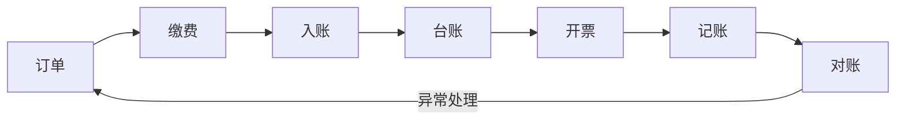
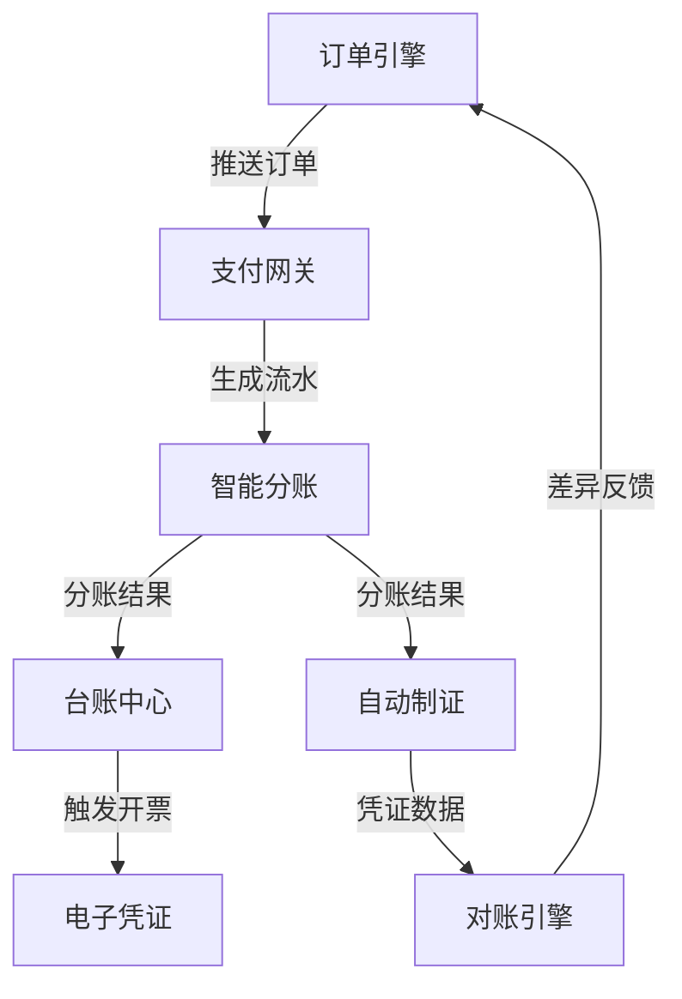

从“订单——缴费——入帐——台账——开票——记账——对账”过程展开说明综合缴费业务过程、业务对象及应用服务

以下从 **“订单→缴费→入账→台账→开票→记账→对账”** 七个环节，系统化拆解综合缴费业务的**过程、对象及应用服务**：

---

### 一、全流程概览  


---

### 二、分环节详解  
#### **1. 订单（业务起点）**  
- **业务过程**：  
  用户选择多类收费项目（伙食费+培训费），生成统一订单。  
  **示例**：员工出差时同时缴纳伙食费200元+培训费800元 → 生成合并订单号 `DD20250804001`。  
- **业务对象**：  
  - **订单主表**：订单号、总金额、用户ID  
  - **订单明细**：子项目（伙食费/培训费）、单项金额、核算科目  
- **应用服务**：  
  **订单引擎服务**  
  - 动态组装多业务订单  
  - 校验项目互斥性（如差旅与培训时间冲突）  

---

#### **2. 缴费（支付执行）**  
- **业务过程**：  
  用户通过统一支付入口完成付款，资金进入**综合收款池账户**。  
- **业务对象**：  
  - **支付流水**：全局流水号（如 `PY20250804001`）、支付渠道、订单号  
  - **收款账户**：综合账户（虚拟户）  
- **应用服务**：  
  **统一支付网关服务**  
  - 对接微信/支付宝/银联  
  - 防重提交（同一订单5分钟内仅允许支付1次）  

---

#### **3. 入账（资金确权）**  
- **业务过程**：  
  系统按预设规则将资金拆解至子账户，并标记业务归属。  
  **示例**：  
  ```  
  综合账户收款1000元 → 拆分为：  
  - 伙食费子账户：200元（核算科目：2215.01）  
  - 培训费子账户：800元（核算科目：2241.02）  
  ```  
- **业务对象**：  
  - **分账规则表**：业务类型、分账比例、目标科目  
  - **入账记录**：流水号、子账户、实际到账金额  
- **应用服务**：  
  **智能分账服务**  
  - 自动解析订单明细执行分账  
  - 未匹配规则的资金挂账待处理  

---

#### **4. 台账（业务留痕）**  
- **业务过程**：  
  生成多维度业务视图，支撑部门级管理。  
  **示例报表**：  
  | 部门   | 伙食费 | 培训费 | 总额 |  
  |--------|--------|--------|------|  
  | 销售部 | 8,000  | 15,000 | 23,000 |  
- **业务对象**：  
  - **业务台账**：部门/项目/时间维度统计表  
  - **明细台账**：原始订单+流水数据聚合  
- **应用服务**：  
  **台账中心服务**  
  - 按需生成实时/离线报表  
  - 支持穿透查询至原始流水  

---

#### **5. 开票（用户凭证）**  
- **业务过程**：  
  为缴费人开具电子发票或收据，支持合并开票。  
  **示例**：同一订单的伙食费+培训费 → 合并开具一张发票。  
- **业务对象**：  
  - **发票记录**：发票号码、金额、开票时间、订单号  
  - **开票规则**：合并开票阈值（如>500元强制拆分）  
- **应用服务**：  
  **电子凭证服务**  
  - 对接税务系统自动开票  
  - 按业务类型适配票据模板  

---

#### **6. 记账（财务处理）**  
- **业务过程**：  
  根据分账结果生成会计凭证，入账至总账系统。  
  **凭证示例**：  
  ```  
  借：银行存款-伙食子账户 200元  
  借：银行存款-培训子账户 800元  
  贷：其他应付款-综合收费 1000元  
  ```  
- **业务对象**：  
  - **会计凭证**：凭证号、分录、关联流水号  
  - **科目映射表**：业务类型与会计科目对照关系  
- **应用服务**：  
  **自动制证服务**  
  - 按分账结果批量生成凭证  
  - 凭证异常自动预警（如金额不平衡）  

---

#### **7. 对账（风险闭环）**  
- **业务过程**：  
  每日核对三方数据一致性：  
  ```mermaid
  graph LR
  业务系统台账 --> 对账中心
  银行到账记录 --> 对账中心
  财务系统凭证 --> 对账中心
  ```
- **业务对象**：  
  - **对账结果**：差异类型（长款/短款/错配）  
  - **差异处理工单**：调账或退补费记录  
- **应用服务**：  
  **对账引擎服务**  
  - 自动拉取银行流水与财务凭证  
  - 差异>100元时自动冻结账户  

---

### 三、核心业务对象关系图  
```mermaid
erDiagram
  ORDER ||--o{ PAY_FLOW ： "1:N"
  PAY_FLOW ||--|| ACCOUNT_SPLIT ： "1:1"
  ACCOUNT_SPLIT ||--o{ LEDGER ： "1:N"
  LEDGER ||--|| INVOICE ： "1:1"
  ACCOUNT_SPLIT ||--|| ACCOUNTING_VOUCHER ： "1:1"
  ACCOUNTING_VOUCHER ||--o{ RECONCILIATION ： "1:N"
```

> **说明**：  
> - **订单驱动全流程**，通过流水号贯穿始终  
> - **分账记录**是核心枢纽，连接业务（台账/开票）与财务（凭证/对账）  

---

### 四、关键应用服务协同  


**设计核心**：  
1. **以流水号为黄金链路**，确保七步数据可追溯；  
2. **分账服务为中枢**，解耦业务与财务处理；  
3. **对账服务兜底**，实现资金风险闭环控制。