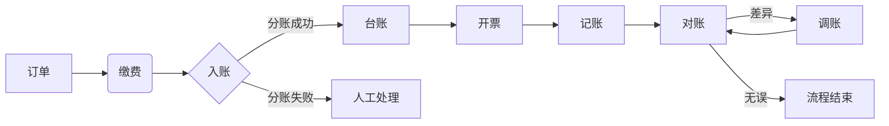

从“订单——缴费——入帐——台账——开票——记账——对账”过程展开说明综合缴费业务过程、业务对象及应用服务

以下从**业务过程、业务对象、应用服务**三个维度，对综合缴费业务的 **“订单→缴费→入账→台账→开票→记账→对账”** 全流程进行系统化拆解：

---

### **一、业务过程详解**  
#### **1. 订单（业务起点）**  
- **过程**：创建缴费订单，明确业务场景及费用明细  
- **输入**：用户选择的业务类型（如培训费）、金额、主体信息  
- **输出**：标准化订单（含唯一订单号、费用明细、支付时效）  

#### **2. 缴费（资金转移）**  
- **过程**：用户支付 → 渠道处理 → 生成交易流水  
- **规则**：  
  - 支付渠道需匹配订单类型（线上扫码/银行转账）  
  - 支付成功必须实时返回流水号至订单系统  

#### **3. 入账（资金确权）**  
- **过程**：资金到达收款账户 → 按规则分账至子科目  
- **关键动作**：  
  - 自动认领（匹配订单与流水）  
  - 异常挂账处理（金额不匹配时）  

#### **4. 台账（业务汇总）**  
- **过程**：基于流水生成多维度业务视图  
- **输出类型**：  
  - 部门台账（如财务部差旅费汇总）  
  - 项目台账（如XX培训班收费统计）  

#### **5. 开票（凭证输出）**  
- **过程**：根据订单类型开具票据  
- **规则**：  
  - 电子发票（培训费）  
  - 电子收据（伙食费）  
  - 票据信息必须回写至订单  

#### **6. 记账（财务转化）**  
- **过程**：将业务数据转化为会计凭证  
- **分录示例**：  
  ```  
  借：银行存款-综合户  XXX元  
  贷：预收账款-培训费 XXX元  
      其他应付款-伙食费 XXX元  
  ```  

#### **7. 对账（风险闭环）**  
- **过程**：三方核对（业务台账 vs 银行流水 vs 财务凭证）  
- **自动化**：  
  - 差异>100元触发预警  
  - 自动生成差异报告  

---

### **二、核心业务对象**  
| **环节** | **业务对象** | **关键字段**               | **作用**  |     |
| ------ | -------- | ---------------------- | ------- | --- |
| 订单     | `缴费订单`   | 订单号、业务类型、金额、缴费主体       | 业务场景标准化 |     |
| 缴费     | `交易流水`   | 流水号、支付渠道、订单号、支付状态      | 资金流动证据链 |     |
| 入账     | `分账记录`   | 主流水号、子账户、分账金额、状态       | 资金归属标识  |     |
| 台账     | `业务台账`   | 部门/项目、费种、周期、实收/欠费      | 业务管理视图  |     |
| 开票     | `票据记录`   | 票据号、订单号、开票金额、类型（普票/专票） | 税务合规依据  |     |
| 记账     | `会计凭证`   | 凭证号、分录、关联流水号、制证人       | 财务核算基础  |     |
| 对账     | `对账结果`   | 批次号、差异金额、调整凭证号         | 风险管控锚点  |     |

> 💡 **对象关联关系**：  
> `订单号` → 关联→ `交易流水` → 驱动→ `分账记录` → 生成→ `业务台账`  
> `票据记录` + `会计凭证` ← 基于 ← `交易流水`  

---

### **三、支撑应用服务**  
#### **1. 订单中心服务**  
- **功能**：  
  - 多业务订单模板管理（培训/伙食/会议）  
  - 订单状态全链路追踪  
- **复用点**：所有业务统一订单入口  

#### **2. 智能支付路由**  
- **功能**：  
  - 自动选择最优支付渠道（费率/成功率）  
  - 防重复支付拦截  
- **案例**：培训费>5000元强制走对公转账  

#### **3. 自动分账引擎**  
- **功能**：  
  - 按预设规则拆分资金（例：伙食费入子账户A，培训费入子账户B）  
  - 支持手续费抵扣分账  
- **规则配置**：  
  ```json
  { "业务类型": "综合收费", 
    "分账规则": [
      { "科目": "伙食费", "比例": "20%" }, 
      { "科目": "培训费", "比例": "80%" }
    ]
  }
  ```

#### **4. 台账生成服务**  
- **功能**：  
  - 按部门/项目/周期动态聚合数据  
  - 支持欠费预警（如培训费未缴清名单）  
- **输出**：可视化Dashboard+导出报表  

#### **5. 票据管理服务**  
- **功能**：  
  - 对接税控系统自动开票  
  - 票据与订单/流水双向绑定  
- **规则**：培训费必须开增值税发票  

#### **6. 智能记账服务**  
- **功能**：  
  - 自动生成凭证分录（基于业务类型+分账规则）  
  - 一键推送至财务系统（用友/金蝶）  
- **示例分录逻辑**：  
  ```python
  if 业务类型 == "伙食费":
     生成凭证(借：银行存款, 贷：其他应付款-伙食费)
  elif 业务类型 == "培训费":
     生成凭证(借：银行存款, 贷：预收账款-培训费)
  ```

#### **7. 对账机器人**  
- **功能**：  
  - 自动拉取银行流水  
  - 三端数据（台账/凭证/银行）AI比对  
  - 差异自动生成调账建议  

---

### **四、全流程协同示意图**  


> **关键设计原则**：  
> - **一致性**：订单号贯穿全流程（订单→流水→台账→凭证）  
> - **自动化**：分账/开票/记账/对账实现无人值守  
> - **可扩展**：通过配置规则支持新增业务类型（如新增“会议费”）  

---

### **总结：综合缴费业务核心价值**  
1. **效率提升**：全流程自动化率可达90%（对比传统手工模式）  
2. **风险可控**：对账环节实现T+0差异发现  
3. **业务兼容**：一套架构支撑伙食费、培训费等N类场景  
4. **审计友好**：订单→流水→凭证全链路留痕