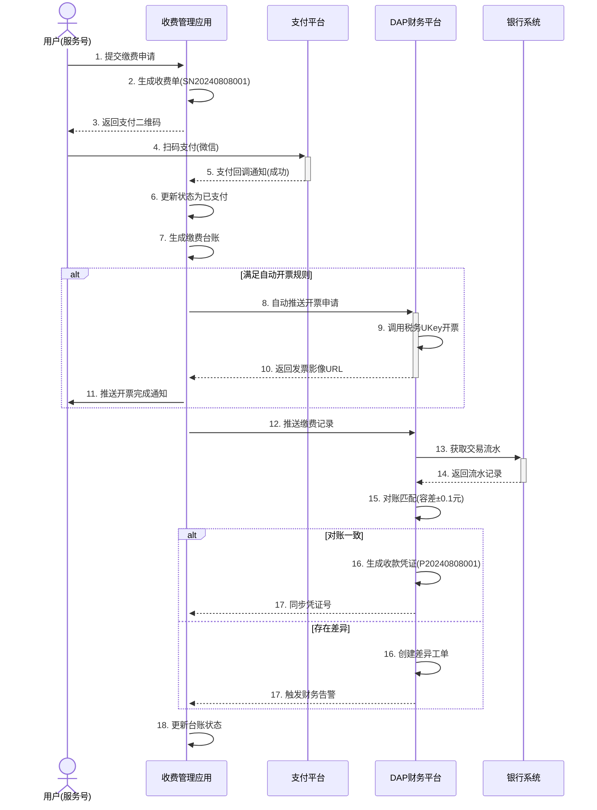
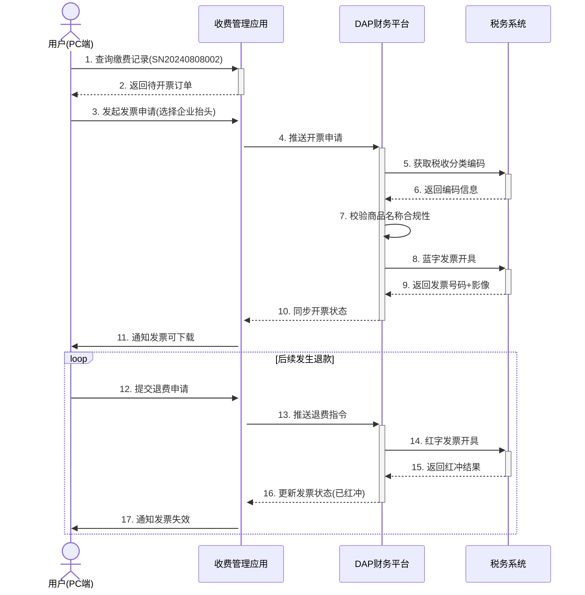
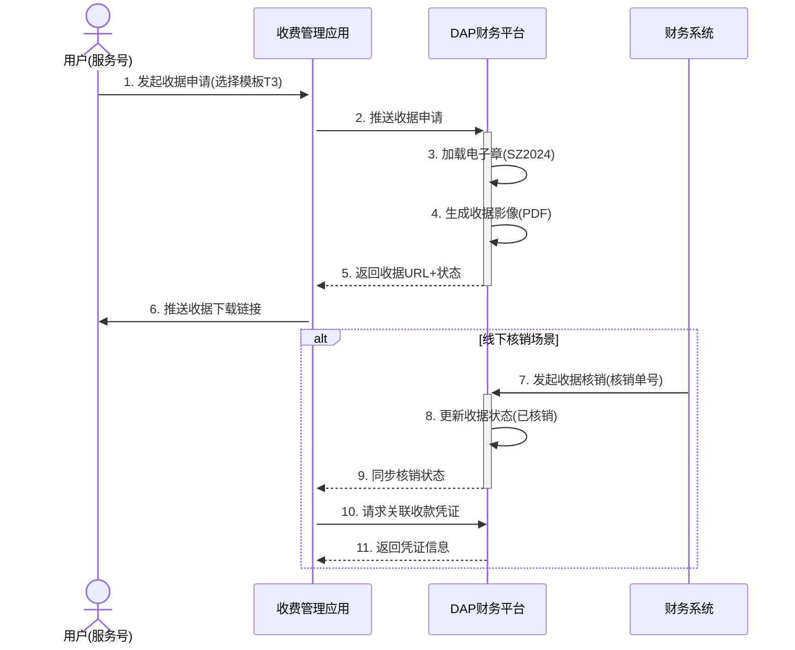
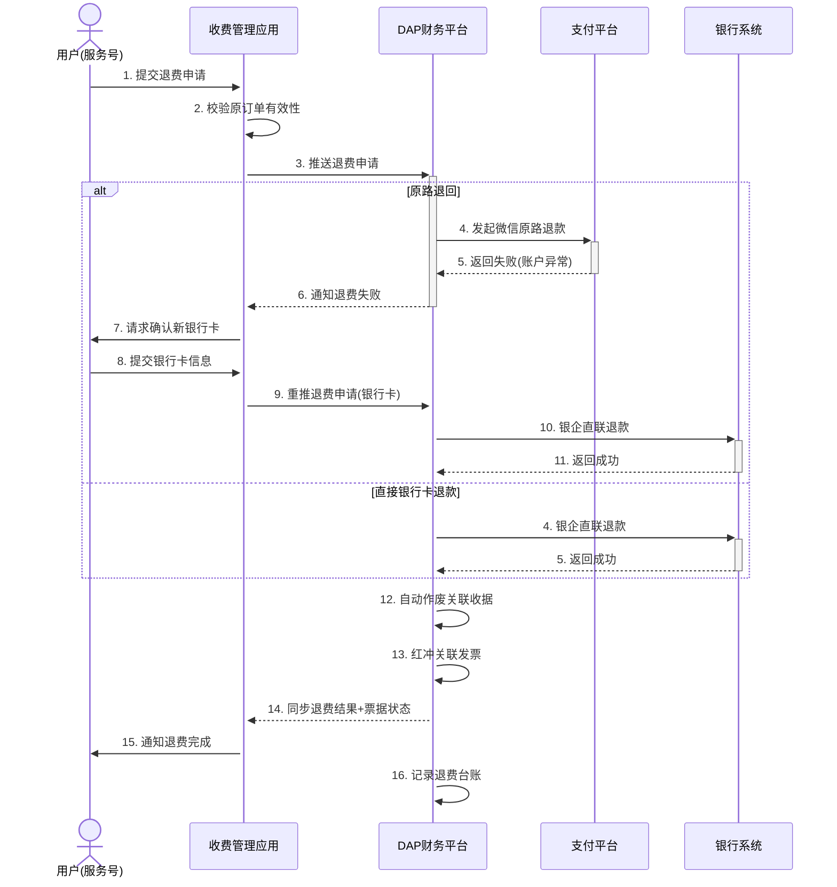

请分场景构建详细时序图

以下是针对综合收费管理四大核心场景的详细时序图设计，涵盖收费支付、发票管理、收据管理、退费管理的完整交互流程：

---

### 场景1：收费支付（含自动开票）


---

### 场景2：发票管理（手动申请+红冲）


---

### 场景3：收据管理（申请+核销）


---

### 场景4：退费管理（原路退回失败转银行卡）


---

### 关键设计说明：
1. **支付中断补偿机制**  
   - 场景1步骤5：支付平台回调失败时，收费系统主动轮询支付状态
   - 设置超时阈值（如30秒），触发自动补偿查询

2. **双通道退费设计**  
   - 场景4展示两种路径：
     - 优先原路退回（步骤4-8）
     - 失败后切换银行卡退款（步骤9-11）
   - 本地资金池垫付能力（虚线补充流程）

3. **财务合规控制点**  
   - 发票红冲前强制审批（场景2步骤14）
   - 大额退费（>5万）增加财务复核节点

4. **状态同步保障**  
   - 所有关键操作（开票/退费/核销）均实现：
     ``` 
     DAP → 收费系统：状态回传
     收费系统 → 用户端：状态通知
     ```

5. **自动化处理优化**  
   - 自动开票规则引擎（场景1步骤8）
   - 对账容差自动调账（场景1步骤15）

---

### 时序图优化亮点：
1. **异常分支显式标注**  
   - 使用`alt/else`清晰展示正常流与异常流
   - 如退费失败转银行卡、对账差异处理

2. **关键属性传递**  
   - 标注核心业务标识：流水号(SNxxx)、凭证号(Pxxx)
   - 票据状态变更记录（已开/红冲/核销）

3. **财务系统深度集成**  
   - 展示与税务系统、银行系统的深度交互
   - 强调DAP作为财务中枢的定位

4. **用户触点全覆盖**  
   - 区分服务号移动端与PC端操作场景
   - 关键节点均有用户通知机制

此设计完整呈现了收费业务的全链路闭环，既满足高频交易效率要求，又保障财务合规性，通过清晰的异常处理路径增强系统鲁棒性。