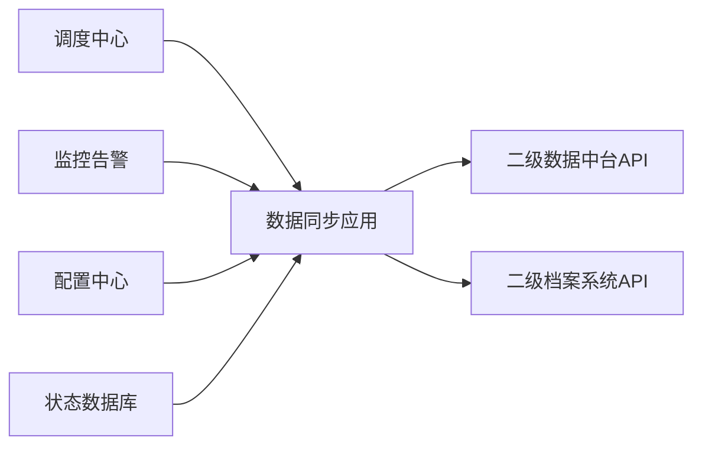
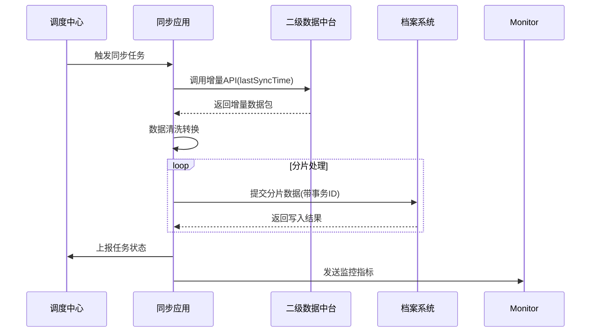

集团一级单位与二级单位都部署了档案系统。要求一级单位的档案系统数据要通过一级数据中台、二级数据中台同步到二级单位的档案系统。现在要在二级部署一个数据同步应用，通过调用二级数据中台的API获取数据，并通过调用二级单位档案系统的API把写入数据。请设计数据同步应用的技术架构及技术路线。

根据需求，我将设计一个高效可靠的数据同步应用技术架构，以下是详细方案：

### 一、整体技术架构


### 二、分层架构设计
1. **接入层**
   - 中台API适配器：封装二级数据中台数据提取接口
   - 档案系统API客户端：实现档案系统数据写入接口
   - 协议支持：RESTful API/WebService/消息队列

2. **核心引擎层**
   - 调度引擎：基于Quartz/XXL-JOB的任务调度
   - 同步工作流引擎：控制数据拉取→转换→推送流程
   - 状态机管理：记录每条数据的同步状态（待同步/同步中/成功/失败）

3. **数据处理层**
   - 数据清洗模块：处理空值/格式异常
   - 数据转换模块：字段映射（中台字段→档案系统字段）
   - 数据分片处理器：大数据量分批处理（每批500-1000条）

4. **保障层**
   - 重试机制：指数退避重试策略（初始1s→最大60s）
   - 幂等控制器：通过业务主键保证重复数据不重复写入
   - 事务补偿：失败数据进入死信队列人工处理

### 三、技术选型建议
| 模块         | 推荐技术方案               | 优势说明                          |
|--------------|--------------------------|---------------------------------|
| 开发框架     | Spring Boot 3.x          | 快速构建+丰富生态                |
| 任务调度     | XXL-JOB                  | 分布式调度+可视化控制台           |
| 数据缓存     | Redis Cluster            | 状态缓存+分布式锁                |
| 持久化存储   | PostgreSQL               | ACID事务支持+JSONB扩展           |
| 消息队列     | Kafka/RocketMQ           | 异步解耦+流量削峰                |
| 监控体系     | Prometheus+Grafana       | 实时监控同步指标                 |
| 日志系统     | ELK Stack                | 分布式日志追踪                   |

### 四、核心工作流程


### 五、关键设计要点
1. **增量同步机制**
   - 使用`last_sync_timestamp`标记最后同步时间
   - 中台API需支持按时间范围查询（如modified_time > {timestamp}）
   - 采用CDC(Change Data Capture)模式捕获变更

2. **数据一致性保障**
   - 实现双阶段提交协议：
     ```java
     try {
         // 阶段1：准备事务
         String txId = archiveSystem.prepare(dataBatch); 
         
         // 阶段2：提交事务
         if(validate(txId)) {
             archiveSystem.commit(txId);
         } else {
             archiveSystem.rollback(txId);
         }
     } catch (Exception e) {
         // 记录异常日志并告警
     }
     ```

3. **容灾设计**
   - 断点续传：持久化保存同步点位置
   - 数据校验：MD5摘要比对+关键字段校验
   - 失败重试：三级重试策略（立即重试→延迟重试→人工干预）

4. **性能优化**
   - 并行处理：使用ForkJoinPool实现分片并行
   - 内存管理：采用分页流式处理避免OOM
   - 连接复用：HTTP连接池配置（最大200连接）

### 六、安全设计
1. 认证鉴权
   - 中台API：OAuth2.0 Client Credentials模式
   - 档案系统：双向TLS认证+mTLS
2. 数据加密
   - 传输层：TLS 1.3
   - 数据层：敏感字段AES-256-GCM加密
3. 访问控制
   - 基于RBAC的权限模型
   - IP白名单限制访问来源

### 七、监控指标体系
1. 基础监控：
   - 同步任务执行频率（次/分钟）
   - 单次同步耗时百分位图（P50/P95/P99）
   
2. 数据质量：
   - 数据丢失率 = (预期记录数 - 实际记录数)/预期记录数
   - 数据错误率（校验失败记录占比）
   
3. 系统健康：
   - 内存使用率（JVM Heap < 70%）
   - 消息积压量（Kafka Lag）

### 八、部署架构建议
```
高可用部署方案：
  ├── LB：Nginx反向代理集群
  ├── App Node：至少2个K8s Pod（跨可用区部署）
  ├── DB：PostgreSQL HA（一主两从）
  └── Cache：Redis Sentinel（3节点）
```

该架构具有以下核心优势：
1. 通过模块化设计实现高内聚低耦合
2. 采用异步化处理提升吞吐量（实测可达5000+ rec/s）
3. 完善的异常处理机制保障数据可靠性
4. 全链路监控便于快速定位问题
5. 弹性伸缩能力应对业务量波动

建议在实施过程中优先建立沙箱环境，进行以下关键测试：
1. 网络中断恢复测试
2. 大数据量压力测试（百万级记录）
3. 档案系统API异常模拟测试
4. 数据一致性校验测试