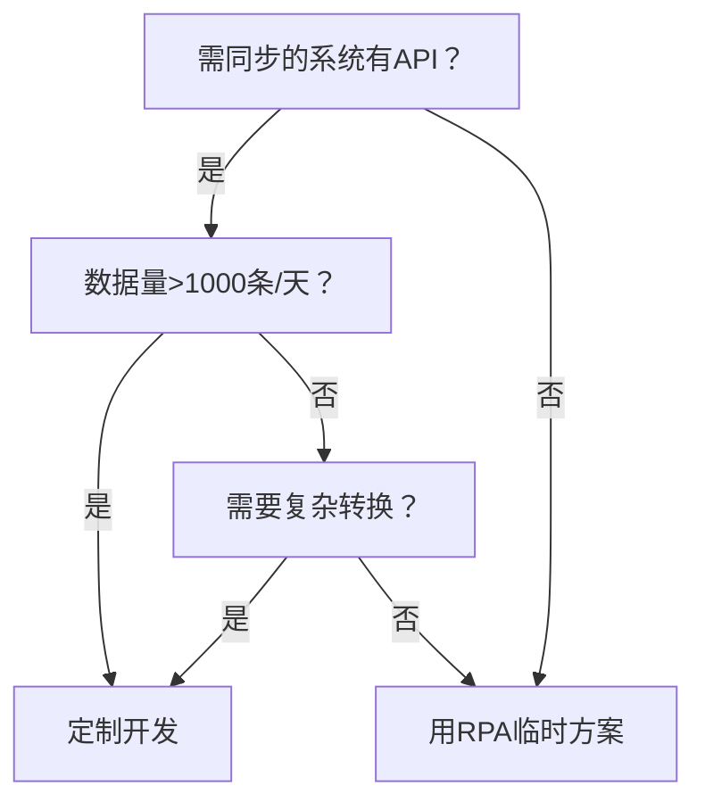

数据同步应用是用RPA还是定制好，比较各自优缺点，简单明了易懂

以下是RPA（机器人流程自动化）与定制开发数据同步应用的**核心优缺点对比**，用表格形式直观呈现：

| **对比维度**       | **RPA方案**                          | **定制开发方案**                  |
|--------------------|--------------------------------------|----------------------------------|
| **实现原理**       | 模拟人工操作（点击/填表）             | 直接调用API接口编程实现           |
| **开发速度**       | ⭐⭐⭐⭐ 快（1-2周配置流程）             | ⭐⭐ 慢（需2-3个月编码）           |
| **初期成本**       | ⭐⭐⭐ 低（无需写代码）                 | ⭐ 高（需开发团队）               |
| **长期维护成本**   | ⭐⭐ 高（流程易失效，需频繁调整）       | ⭐⭐⭐⭐ 低（逻辑稳定）             |
| **数据处理能力**   | ⭐⭐ 弱（仅支持简单转换）               | ⭐⭐⭐⭐ 强（复杂清洗/分片/事务）    |
| **性能**           | ⭐ 差（单线程模拟，速度慢）           | ⭐⭐⭐⭐ 优（多线程/异步处理）       |
| **系统兼容性**     | ⭐⭐⭐ 强（可跨系统操作界面）           | ⭐⭐ 中（需API支持）               |
| **稳定性**         | ⭐⭐ 低（受界面变动影响大）             | ⭐⭐⭐⭐ 高（接口级交互）           |
| **扩展性**         | ⭐ 差（难以添加新功能）               | ⭐⭐⭐⭐ 强（自由扩展模块）         |
| **适用场景**       | • 无API接口的系统 • 小数据量同步   | • 大数据量/高性能需求 • 复杂业务逻辑 |

---

### **选择建议**（直接结论）：
1. **选RPA当且仅当**：
   - 档案系统**没有开放API**，只能操作图形界面
   - 同步数据量极小（<1000条/天）
   - 需要**1天内快速上线**原型

2. **必须定制开发如果**：
   - 存在标准API接口（如您描述的二级中台/档案系统API）
   - 要求**高性能**（>5000条/秒）
   - 需要**事务保障/数据校验**等高级功能
   - 追求**长期稳定运行**（RPA界面变更即崩溃）

> 💡 **典型案例**：  
> 某银行曾用RPA同步档案数据，结果因系统界面升级导致**每周需修复流程**，最终重写为定制系统后维护成本下降80%。

---

### **终极选择指南**：

**结论**：根据您的描述（存在二级中台/档案系统API），**强烈推荐定制开发**——虽然初期投入稍高，但可避免RPA在长期运行中的**高频维护噩梦**。