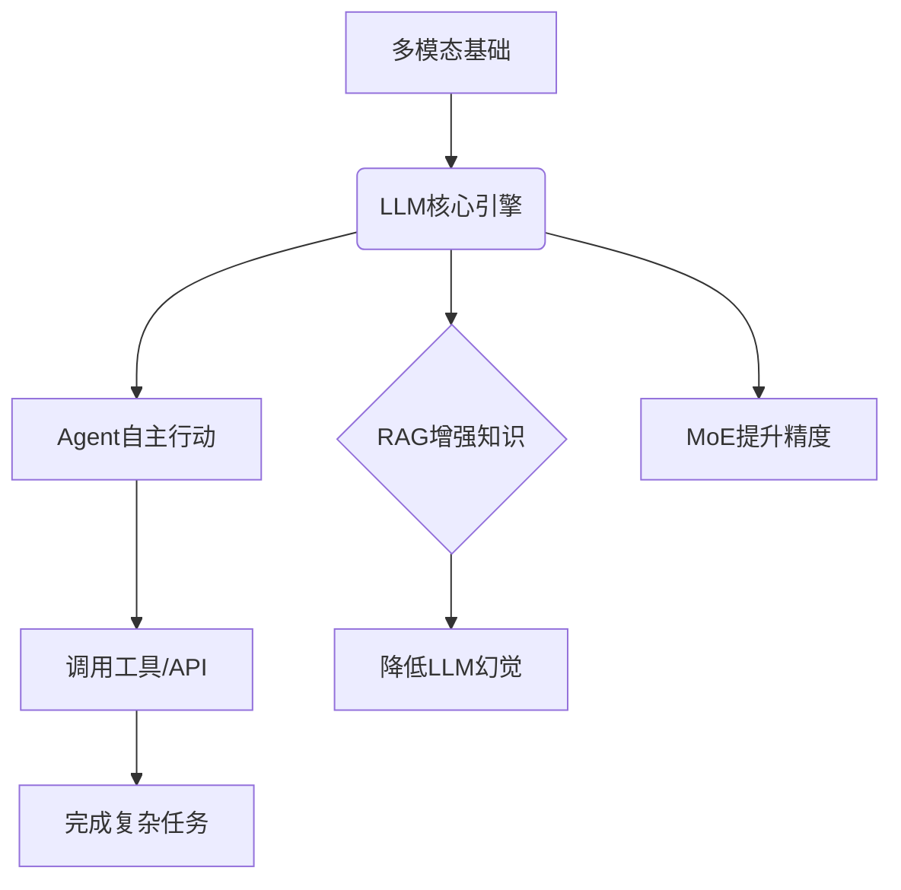

以下是AI领域核心技术的简明解析，涵盖定义、关联关系、代表产品及应用场景：

---

### **核心术语速查表**
| 术语         | 定义                          | 典型产品                  | 应用场景                     |
|--------------|-------------------------------|---------------------------|------------------------------|
| **LLM**      | 大语言模型：通过海量文本训练，实现自然语言理解与生成的基础AI模型 | GPT-4、Claude、通义千问、DeepSeek | 智能客服、内容创作、代码生成   |
| **RAG**      | 检索增强生成：从外部知识库检索信息，结合LLM生成更准确的答案     | LangChain、LlamaIndex     | 企业知识库问答、法律条文解析   |
| **Agent**    | 智能代理：能自主规划、调用工具完成复杂任务的AI程序（=LLM+记忆+工具） | AutoGPT、扣子（Coze）      | 自动数据分析、旅行规划、科研助手 |
| **MoE*** | 混合专家模型：将任务拆分给多个专业子模型（专家），动态选择最优结果 | DeepSeek-V2、Mixtral-8x7B | 高精度专业问答（医疗/金融）    |
| **多模态**   | 支持文本/图像/音频/视频等多种输入输出形式的AI能力           | Gemini、GPT-4o、Qwen-VL   | 工业质检、盲人辅助、短视频生成 |

> *注：用户提到的MCP应为MoE（Mixture of Experts）的笔误*

---

### **技术关联图解**

### **关键关系说明**
1. **LLM是地基**  
   - 所有技术依赖LLM的语言理解能力  
   - 示例：Agent用LLM解析用户指令，RAG用LLM整合检索结果  

2. **RAG补足LLM短板**  
   - 解决LLM的“知识滞后”与“事实幻觉”  
   - 工作流：用户提问 → 检索知识库 → LLM生成答案  

3. **Agent = LLM + 工具**  
   - LLM作为“大脑”，调用工具（计算器/搜索引擎）作为“手脚”  
   - 示例：旅行Agent自动查天气（工具）+ 排行程（LLM）  

4. **MoE优化LLM效率**  
   - 将问题路由给专业子模型（如医疗专家/金融专家）  
   - 效果：相同算力下，精度提升30%+  

5. **多模态扩展LLM边界**  
   - 使LLM能“看图说话”“听音辨意”  
   - 示例：GPT-4o分析CT影像（图）+ 患者描述（文）→ 生成诊断报告  

---

### **典型应用场景**
#### 1. **企业知识管理（RAG+LLM）**  
   - **痛点**：员工查找制度文件耗时  
   - **方案**：上传员工手册/合同库 → RAG检索 → LLM生成摘要  
   - **工具**：LangChain + 私有化部署千问  

#### 2. **智能销售助手（Agent+多模态）**  
   - **流程**：  
     ① 识别客户语音需求 → ② 检索产品库（RAG）→ ③ 生成报价单（LLM）→ ④ 自动发送邮件（工具调用）  
   - **产品**：字节扣子 + GPT-4o  

#### 3. **工业质检（多模态+MoE）**  
   - **实现**：  
     - 摄像头拍摄产品 → 多模态模型识别缺陷 → MoE路由给“划痕专家”“变形专家”分析 → 输出质检报告  
   - **工具**：百度视觉大模型 + MoE微调  

---

### **技术演进趋势**
1. **LLM平民化**：开源模型（DeepSeek/Mistral）降低使用门槛  
2. **Agent爆发**：2024年“AI智能体”成为大厂竞争焦点（如阿里、字节）  
3. **多模态统一**：GPT-4o证明语音/视觉/文本可融合为单一模型  
4. **MoE主流化**：推理成本下降50%，将逐步替代传统稠密模型  

> 一句话总结：**LLM是心脏，RAG供血，Agent行动，MoE提效，多模态突破次元**——五者协同正重构人机交互范式。