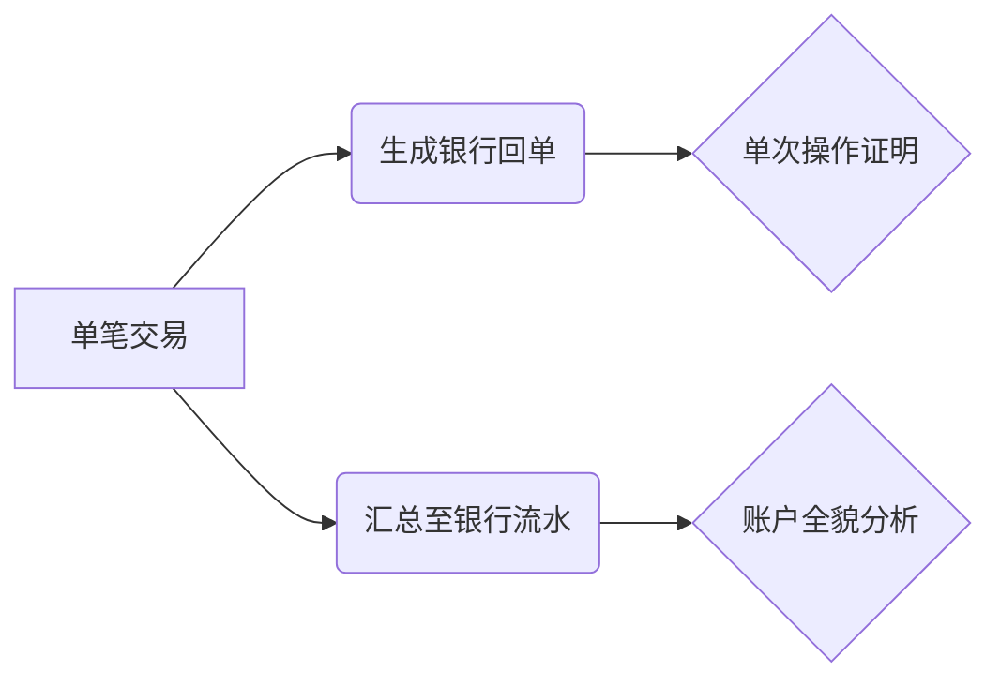

简单明了说明什么是银行回单与银行流水，说明异同点与关系，并举例

以下是银行回单与银行流水的**核心定义、异同对比、关系说明及实例解析**，帮助您快速掌握两者区别：

---

### **一、基础定义**
| **术语**     | **定义**                                                                 | **本质**               |
|--------------|--------------------------------------------------------------------------|------------------------|
| **银行回单** | 单笔银行业务的**交易凭证**，记录某次具体操作（如转账、缴费）的结果与明细       | **点状证明**           |
| **银行流水** | 一段时间内（如1个月）账户所有资金变动的** chronological记录**，包含多笔交易汇总 | **线状记录**           |

---

### **二、核心区别（对照表）**
| **对比维度**   | **银行回单**                          | **银行流水**                      |
|----------------|---------------------------------------|-----------------------------------|
| **内容范围**   | 单次交易详情                          | 多笔交易按时间排序的清单          |
| **核心要素**   | 交易金额、对方账户、时间、用途、流水号 | 期初余额+每笔收支+期末余额        |
| **时间属性**   | 记录**某一时刻**的交易                | 展示**时间段**的资金流动          |
| **主要用途**   | 证明单次操作有效性（如报销凭证）      | 反映账户整体收支状况（如贷款审核）|
| **获取方式**   | 实时打印（网银/柜台）                 | 需申请（柜台/网银下载）           |
| **法律效力**   | 需银行电子签章/柜台公章               | 需银行加盖业务公章                |

---

### **三、典型实例**
#### **场景1：工资发放**  
- **银行回单**：  
  > 公司财务向员工A转账工资5,000元，生成回单显示：  
  > **付款账户**：XX公司 ***1234  
  > **收款账户**：员工A ***5678  
  > **金额**：5,000元  
  > **时间**：2025-03-05 10:30:21  
  > **用途**：工资  

- **银行流水**：  
  ```plaintext
  员工A的2025年3月流水（摘要）：  
  03/01 余额转入    +8,000元  
  03/05 工资收入    +5,000元  ← 对应回单记录  
  03/10 消费支出    -1,200元  
  ...  
  03/31 期末余额    11,800元  
  ```

#### **场景2：贷款申请**  
- **回单作用**：证明首付款已支付（提供购房转账回单）  
- **流水作用**：银行审核6个月流水，确认月收入＞月供2倍  

---

### **四、关键关系**

- **互补性**：  
  - 流水中的每笔交易**均可追溯回单**（如流水显示“3月5日收入5,000元”，对应工资转账回单）  
  - 回单是流水的**原子单元**，流水是回单的**时序整合**  
- **协作场景**：  
  企业报税：用**流水**统计季度总收支 → 抽查大额交易时提供**回单**作为凭证  

---

### **五、一句话总结**
> **银行回单是“点”**（单次交易凭证），**银行流水是“线”**（周期资金轨迹），两者互为证据链，共同构成账户的 **“点-线-面”完整证据体系**。