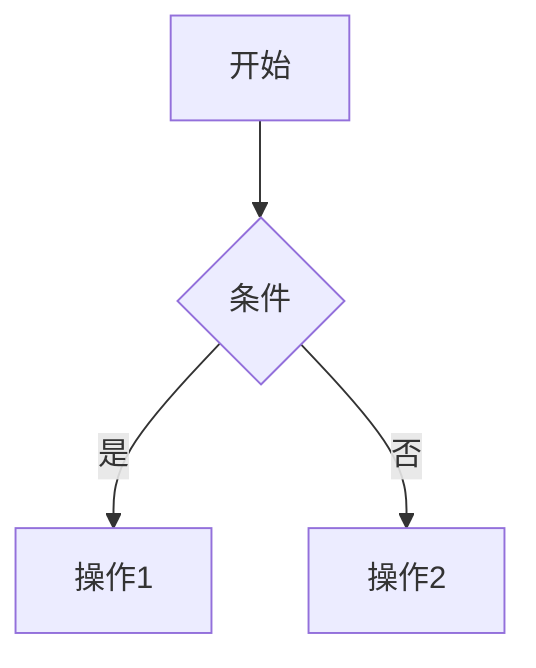

关键词：**deepseek、学习、标记
### deepseek

以下是Markdown语法的详细指南，包含常用语法及示例：

---

### **1. 标题**
```markdown
# 一级标题
## 二级标题
### 三级标题
#### 四级标题
##### 五级标题
###### 六级标题
```

---

### **2. 段落与换行**
- **段落**：段落之间用空行分隔。
- **换行**：行尾添加两个空格或使用`<br>`标签。  
  示例：  
  ```
  这是第一行（末尾两空格）  
  这是第二行。
  ```

---

### **3. 文本强调**
```markdown
*斜体* 或 _斜体_  
**粗体** 或 __粗体__  
***粗斜体*** 或 ___粗斜体___  
~~删除线~~  
```

---

### **4. 列表**
#### **无序列表**
```markdown
- 项目1
- 项目2
  - 子项目（缩进2空格）
* 另一种符号
```

#### **有序列表**
```markdown
1. 第一项
2. 第二项
   1. 子项（缩进3空格）
```

---

### **5. 链接与图片**
#### **链接**
```markdown
[显示文本](https://example.com)  
自动链接：<https://example.com>
```

#### **图片**
```markdown
  
示例：  

```

---

### **6. 代码**
#### **内联代码**
```markdown
使用反引号包裹：`print("Hello World")`
```

#### **代码块**
- **通用语法**（指定语言可高亮）：
  ````markdown
  ```python
  def hello():
      print("Hello World")
  ```
  ````

---

### **7. 表格**
```markdown
| 左对齐 | 居中对齐 | 右对齐 |
|:-------|:--------:|-------:|
| 单元格 | 单元格   | 单元格 |
| 内容   | 内容     | 内容   |
```

---

### **8. 引用**
```markdown
> 引用内容  
> 多行引用  
>> 嵌套引用
```

---

### **9. 分隔线**
```markdown
---  
***  
___
```

---

### **10. 任务列表（GFM扩展）**
```markdown
- [x] 已完成任务  
- [ ] 未完成任务
```

---

### **11. 转义字符**
使用反斜杠`\`转义特殊字符：  
```markdown
\* 转义星号  
\# 转义井号
```

---

### **12. 高级功能（部分平台支持）**
#### **流程图（Mermaid）**
````markdown

````

#### **数学公式（LaTeX）**
```markdown
行内公式：$E=mc^2$  
块级公式：  
$$
\sum_{i=1}^n i = \frac{n(n+1)}{2}
$$
```

---

### **常用工具与资源**
- **在线编辑器**：  
  [StackEdit](https://stackedit.io/) | [Markdown Live Preview](https://markdownlivepreview.com/)
- **官方文档**：  
  [CommonMark规范](https://commonmark.org/) | [GitHub Flavored Markdown](https://github.github.com/gfm/)
- **桌面工具**：  
  Typora | VS Code（安装Markdown插件）

---

掌握这些语法后，可高效编写文档、README文件、博客等。不同平台（如GitHub、Notion）可能支持额外扩展语法，建议查阅对应文档。